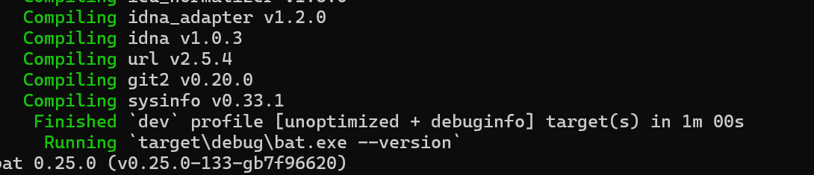

# TOSS2025 Lab01 Assignment Report

**Class**: 2306 **Name**: 王贝迪 **Student ID**: 20232241399

## Task01: 安装Rust开发环境

### 步骤

1. 下载安装rustup（Rust工具链安装器）：

   ```
   Bash
   curl --proto '=https' --tlsv1.2 -sSf https://sh.rustup.rs | sh
   ```

2. 选择默认安装选项（按回车）。

3. 添加环境变量：

   ```
   Bash
   source "$HOME/.cargo/env"
   ```

4. 验证安装：

   ```
   Bashrustc --version  # 输出示例：rustc 1.72.0 (5680fa18f 2023-08-23)
   cargo --version  # 输出示例：cargo 1.72.0 (103a7ff2e 2023-08-15)
   ```


## Task02: 熟悉cargo命令实践报告

### 实践项目1: `bat` (语法高亮的`cat`替代工具)

#### 步骤说明

1. **克隆项目**

   

   ```
   Bash
   git clone https://github.com/sharkdp/bat
   cd bat
   ```

   #### 2. 编译项目

   ```
   Powershell# 使用 MSVC 工具链编译（确保已安装 Visual Studio 构建工具）
   cargo build --release
   ```

   - 输出文件路径：`target\release\bat.exe`

     

     

   #### 3. 运行程序

   ```
   Powershell# 直接通过 cargo 运行
   cargo run -- --version  # 查看版本
   
   # 使用编译后的二进制文件
   .\target\release\bat.exe src\main.rs  # 查看源码（带语法高亮）
   ```

   

   

   

   #### 4. 安装到系统路径

   ```
   Powershell# 安装 bat 到全局路径（默认在 %USERPROFILE%\.cargo\bin）
   cargo install --path .
   ```

## Task03: crate使用实践

### 1. `reqwest`（HTTP客户端库）

#### 示例代码

```
Rustuse reqwest;

#[tokio::main]
async fn main() -> Result<(), reqwest::Error> {
    let response = reqwest::get("https://httpbin.org/ip").await?;
    let body = response.text().await?;
    println!("Response: {}", body);
    Ok(())
}
```

#### 依赖配置（`Cargo.toml`）

```
Toml[dependencies]
reqwest = { version = "0.11", features = ["json"] }
tokio = { version = "1.0", features = ["full"] }
```

#### 输出

```
PlaintextResponse: {
  "origin": "123.45.67.89
}
```

## Task04: Rust-By-Example 练习笔记

### 1. Hello World

- 使用`println!`宏输出文本。
- 格式化字符串：`println!("{}", 42);`。
- 

### 2. 变量绑定

```rust
Rust// variables.rs
fn main() {
    let immutable = 42;     // 不可变绑定
    let mut mutable = 10;   // 可变绑定
    println!("Before: {}", mutable);
    mutable += 1;
    println!("After: {}", mutable);
    
    // 遮蔽（Shadowing）
    let spaces = "   ";
    let spaces = spaces.len(); // 允许重新绑定
    println!("Spaces: {}", spaces);
}
```

### 3. 控制流

#### 控制流

```rust
// control_flow.rs
fn main() {
    // if-else 表达式
    let number = 7;
    let desc = if number % 2 == 0 { "even" } else { "odd" };
    println!("{} is {}", number, desc);

    // 循环控制
    let mut count = 0;
    'counting_up: loop {
        println!("count = {}", count);
        if count == 2 {
            break 'counting_up;
        }
        count += 1;
    }
}
```

表达式：

```
Rustlet number = 6;
if number % 2 == 0 {
    println!("Even");
} else {
    println!("Odd");
}
```

### 4. 函数

- 函数定义：

  ```
  Rustfn add(a: i32, b: i32) -> i32 {
      a + b
  }
  ```

####  所有权系统

```rust
Rust// ownership.rs
fn main() {
    let s1 = String::from("hello");
    let s2 = s1;          // s1 的所有权转移给 s2
    // println!("{}", s1); // 编译错误！s1 已失效
    
    let x = 5;
    let y = x;           // 栈复制，x 仍有效
    println!("x={}, y={}", x, y);
    
    let s3 = String::from("world");
    let len = calculate_length(&s3); // 借用
    println!("'{}' 的长度是 {}", s3, len);
}

fn calculate_length(s: &String) -> usize {
    s.len()
}
```

**输出**：

```rust
Textx=5, y=5
'world' 的长度是 5
```