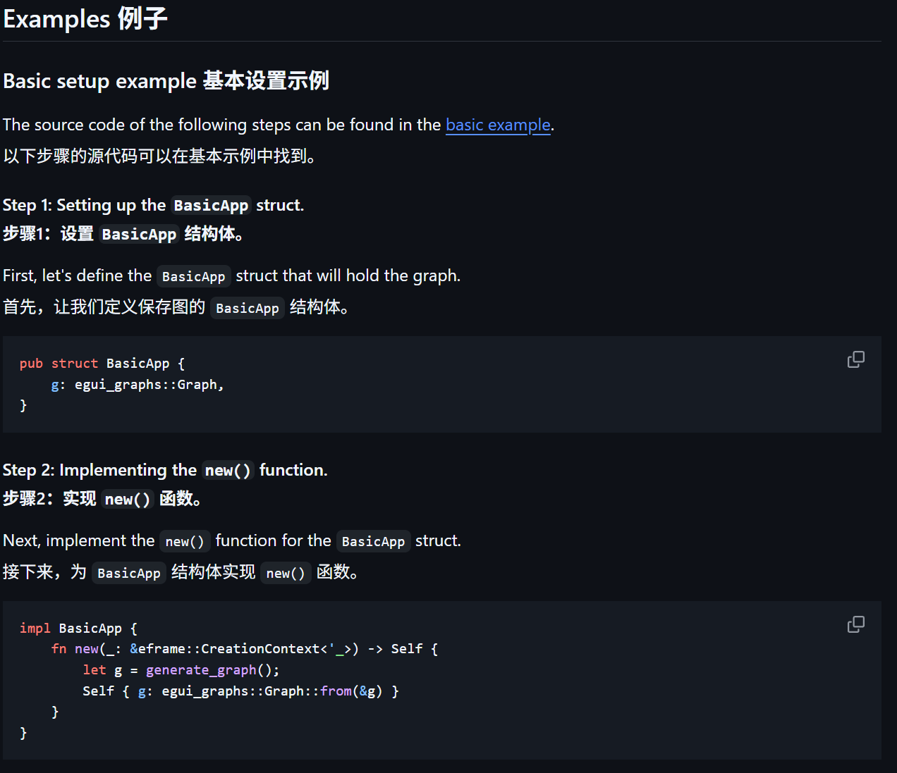
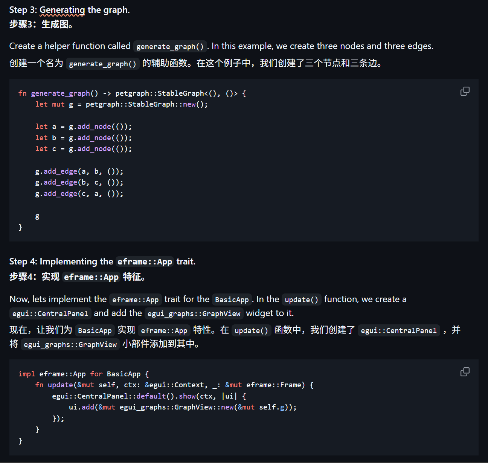
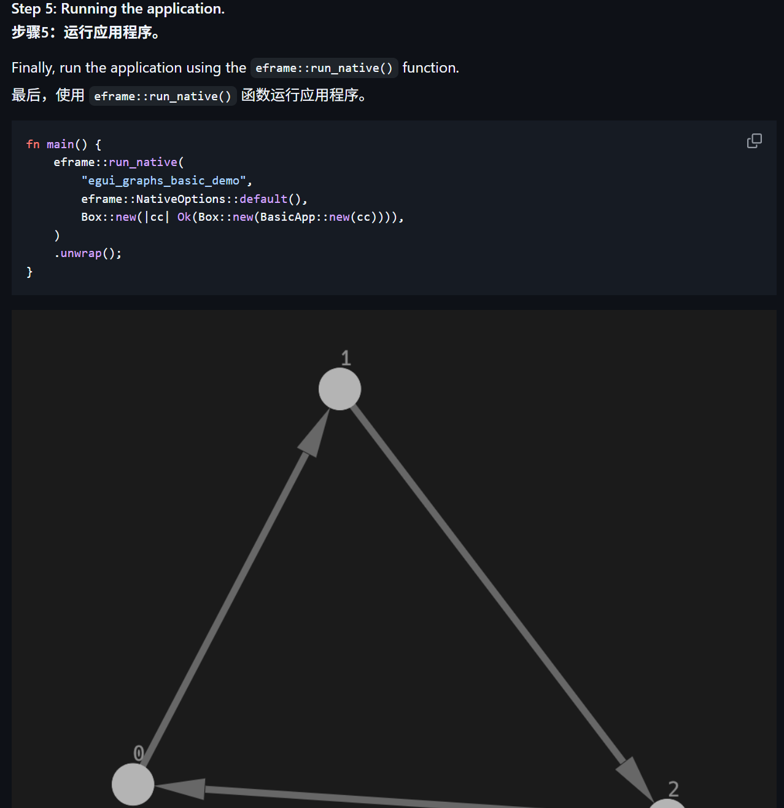
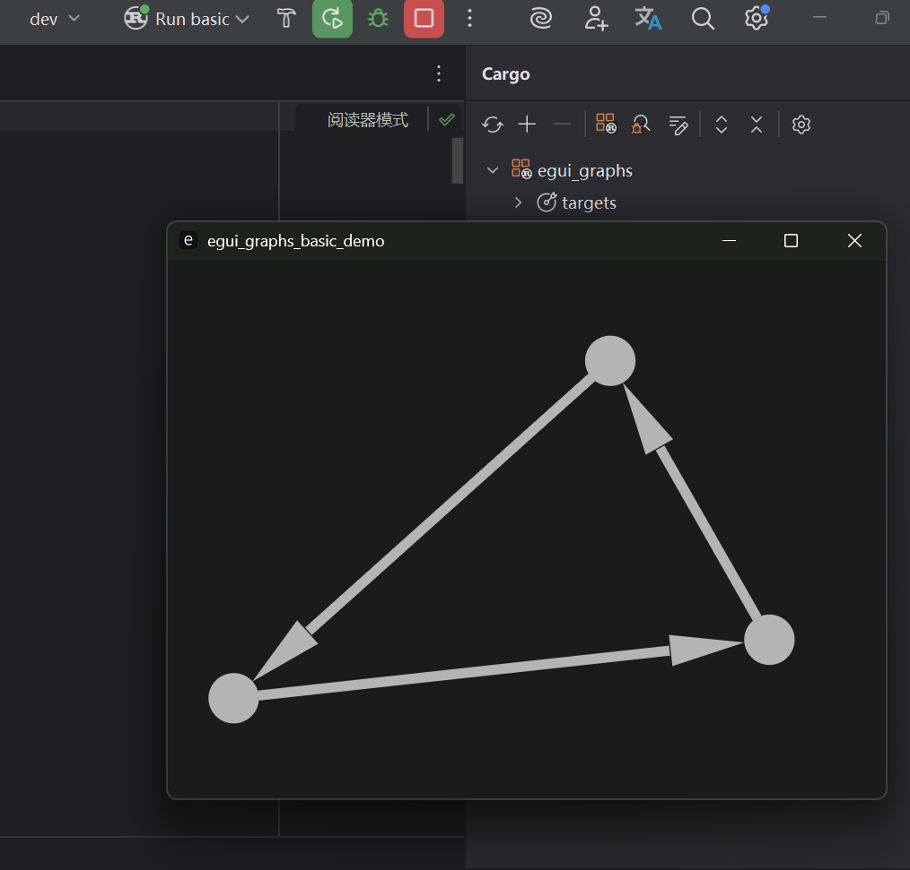
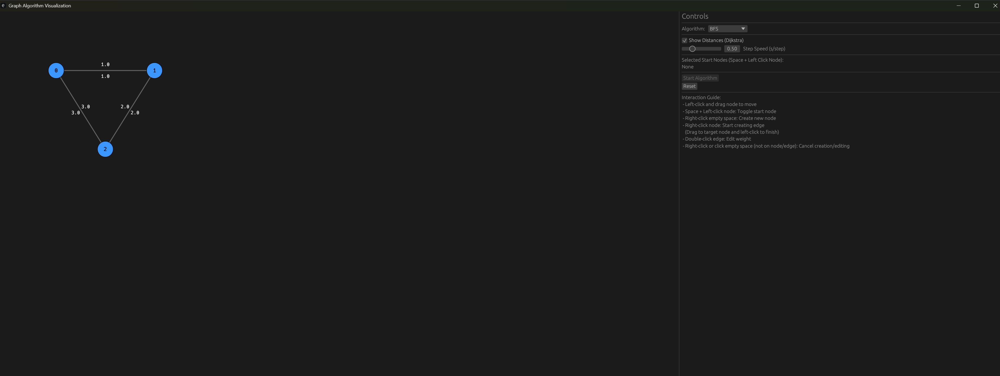

>TOSS lab2   
>
>软2306 王贝迪 20232241399

Lab2 assignments 

1.说明 请阅读 开源项⽬ egui_graphs，学习petgraph库中的图的API、egui_graphs中的示例代码，实现⾃⼰的基于 egui框架的图数据结构和算法的可视化示例。








从github clone后到IDE，运行demo，得到下图



`egui_graphs` 是一个用于在 Rust 的 **Egui**（即时模式 GUI 库）中渲染 **Graphviz** 图表的工具库。它允许开发者通过 DOT 语言描述图结构（如流程图、网络拓扑等），并在 Egui 界面中动态显示这些图表。以下是详细解释：

### **1. 核心概念**

- **Egui**：Rust 的即时模式 GUI 框架，适合嵌入到游戏引擎、工具或实时应用中。

- **Graphviz**：一个开源的图形可视化工具，通过 DOT 语言描述图结构（节点、边、属性）。

- **egui_graphs**：桥梁作用，将 Graphviz 的图渲染为 Egui 的 UI 组件。

- 这个示例展示了如何：

  1. 定义一个结构体来持有要显示的数据（这里是图）。

  2. 使用 `petgraph` 库创建底层的图结构。

  3. 将 `petgraph` 图转换为 `egui_graphs` 可以理解和渲染的格式。

  4. 实现 `eframe::App` 特征，将应用程序逻辑与 `eframe` 窗口框架集成。

  5. 在 `eframe` 的 `update` 方法中使用 `egui` 的布局（`CentralPanel`）和 `egui_graphs` 的图视图控件（`GraphView`）来绘制图。

  6. 使用 `eframe::run_native` 启动桌面应用程序。

     

## 基于 egui框架的图数据结构和算法的可视化示例（利用MCP Builder实现）。

# Rust 图形算法可视化应用 

这个 Rust 程序使用 `eframe` 和 `egui` 库构建了一个简单的图形用户界面 (GUI) 应用，用于创建、编辑和可视化图（Graph）上的算法，如 BFS、DFS 和 Dijkstra。

## 依赖

程序使用了以下外部 crate：

*   `eframe`: 用于创建跨平台的 GUI 应用。
*   `egui`: 一个易于使用的即时模式 GUI 库。

以及 Rust 标准库中的模块，如 `cmp`, `collections`, `f32`。

## 常量

定义了一些常量用于控制图形元素的尺寸、交互区域和颜色：

*   `NODE_RADIUS`: 节点的半径。
*   `INTERACTION_RADIUS`: 节点交互（点击、拖拽）的半径，略大于节点半径以便于操作。
*   `EDGE_INTERACTION_TOLERANCE`: 边缘交互（双击编辑权重）的容差。
*   `COLOR_...`: 定义了不同状态下节点、边缘和文本的颜色。

## 数据结构

定义了表示图所需的核心数据结构：

*   `Node`: 表示图中的一个节点。
    *   `id`: 节点的唯一标识符 (`usize`)。
    *   `position`: 节点在屏幕上的位置 (`Pos2`)。
    *   `edges`: 从该节点出发的边的列表 (`Vec<Edge>`)。

*   `Edge`: 表示图中的一条有向边。
    *   `to`: 边的目标节点的 ID (`usize`)。
    *   `weight`: 边的权重 (`f32`)。
    *   `visited`: 在算法运行中标记边是否被访问过 (`bool`)。
    *   `direction`: 用于偏移权重标签的向量 (`Vec2`)。

*   `Algorithm`: 枚举类型，表示支持的图算法 (`BFS`, `DFS`, `Dijkstra`)。

*   `DijkstraState`: 存储 Dijkstra 算法运行时的状态。
    *   `distances`: 从起点到各个节点的当前最短距离 (`Vec<f32>`)。
    *   `heap`: 用于优先队列的二叉堆 (`BinaryHeap<DijkstraNode>`)。
    *   `predecessors`: 存储最短路径的前驱节点 (`HashMap<usize, usize>`)。
    *   `processed_nodes`: 已确定最终最短距离的节点集合 (`HashSet<usize>`)。

*   `DijkstraNode`: 用于 Dijkstra 算法优先队列的节点结构，包含节点 ID 和距离，实现了 `Eq`, `PartialEq`, `Ord`, `PartialOrd` trait 以便在 `BinaryHeap` 中使用。

*   `CreationState`: 枚举类型，表示用户当前的创建操作状态（无、创建节点、创建边）。

*   `EditingState`: 枚举类型，表示用户当前的编辑操作状态（无、编辑边权重）。

## App 状态 (`GraphApp`)

`GraphApp` 结构体存储了整个应用的状态：

*   `nodes`: 图中的所有节点 (`Vec<Node>`)。
*   `selected_algorithm`: 当前选择的算法 (`Algorithm`)。
*   `work_queue_stack`: 用于 BFS/DFS 的工作队列/栈 (`VecDeque<usize>`)。
*   `visited_nodes`: 用于 BFS/DFS 的已访问节点集合 (`HashSet<usize>`)。
*   `dijkstra_state`: Dijkstra 算法的状态 (`Option<DijkstraState>`)。
*   `dragging_node`: 当前正在拖拽的节点 ID (`Option<usize>`)。
*   `selected_starts`: 算法的起始节点集合 (`HashSet<usize>`)。
*   `creation_state`: 当前的创建状态 (`CreationState`)。
*   `editing_state`: 当前的编辑状态 (`EditingState`)。
*   `next_node_id`: 用于生成新节点 ID 的计数器 (`usize`)。
*   `show_distances`: 是否显示 Dijkstra 距离标签 (`bool`)。
*   `step_speed`: 算法步进的速度（秒/步）(`f32`)。
*   `last_step_time`: 上次算法步进的时间戳 (`f64`)。

### `Default` 实现

`GraphApp` 实现了 `Default` trait，提供了应用启动时的初始状态，包括几个预设的节点和边。

## `eframe::App` 实现

`GraphApp` 实现了 `eframe::App` trait，这是 `eframe` 应用的核心接口。

*   `update(&mut self, ctx: &egui::Context, frame: &mut eframe::Frame)`:
    *   这是应用的主更新循环，每帧都会调用。
    *   `ctx.request_repaint()` 确保持续重绘以支持动画。
    *   调用 `handle_algorithm_step` 处理基于时间的算法步进。
    *   调用 `draw_control_panel` 绘制控制面板。
    *   使用 `egui::CentralPanel::default().show()` 绘制图的视图区域。
    *   在中央面板内，处理图的交互 (`handle_graph_interaction`)。
    *   收集需要绘制的图形元素 (`draw_graph_elements`) 并绘制它们。
    *   绘制临时的交互元素 (`draw_temporary_elements`)。
    *   调用 `show_modal_windows` 显示模态窗口。

## `GraphApp` 方法

`GraphApp` 结构体包含多个方法来组织和实现应用的逻辑：

*   `draw_graph_elements(&self, ui: &egui::Ui, shapes: &mut Vec<Shape>)`: 协调绘制节点、边和距离标签。
*   `draw_edges(&self, ui: &egui::Ui, shapes: &mut Vec<Shape>)`: 绘制边和它们的权重标签。
*   `draw_nodes(&self, ui: &egui::Ui, shapes: &mut Vec<Shape>)`: 绘制节点和它们的 ID。
*   `draw_distance_labels(&self, ui: &egui::Ui, shapes: &mut Vec<Shape>)`: 绘制 Dijkstra 算法的距离标签。
*   `draw_temporary_elements(&self, ui: &egui::Ui)`: 绘制如正在创建的边等临时元素。
*   `handle_graph_interaction(&mut self, ui: &egui::Ui, response: &egui::Response)`: 处理在图视图区域内的鼠标和键盘交互，包括节点拖拽、起点选择、创建节点/边、编辑边权重等。
*   `node_at_pos(&self, pos: Pos2) -> Option<usize>`: 查找给定位置是否有节点，返回节点 ID。
*   `edge_at_pos(&self, pos: Pos2, tolerance: f32) -> Option<(usize, usize)>`: 查找给定位置附近是否有边，返回边的起点和终点 ID。
*   `show_modal_windows(&mut self, ctx: &egui::Context)`: 显示用于节点创建和边权重编辑的模态窗口。
*   `draw_control_panel(&mut self, ctx: &egui::Context)`: 在右侧侧边面板绘制控制选项，包括算法选择、速度控制、起点选择、开始/重置按钮和交互指南。
*   `start_algorithm(&mut self)`: 根据选定的算法初始化算法状态。
*   `handle_algorithm_step(&mut self, ctx: &egui::Context)`: 处理算法的单步执行逻辑，基于时间间隔触发。
*   `step_bfs(&mut self)`: 执行 BFS 算法的一步。
*   `step_dfs(&mut self)`: 执行 DFS 算法的一步。
*   `step_dijkstra(&mut self)`: 执行 Dijkstra 算法的一步。
*   `reset_visits(&mut self)`: 重置所有节点的访问状态和边的访问状态。
*   `reset_algorithm_state(&mut self)`: 重置所有算法相关的状态。

## 主函数 (`main`)

*   `main()`: 应用的入口点。
    *   设置 eframe 的选项，如窗口标题。
    *   调用 `eframe::run_native` 启动 GUI 应用，传入应用名称、选项和创建 `GraphApp` 实例的闭包。

总的来说，代码结构清晰，将数据、UI 绘制、交互处理和算法逻辑分成了不同的方法，实现了基本的图编辑和三种经典图算法的可視化功能。

```rust
use eframe::egui;
use egui::{
    epaint::{CircleShape, Color32, Shape, Stroke, TextShape}, // Import TextShape
    text::LayoutJob,
    FontId, Pos2, Vec2, // Removed Align2
};
use std::{
    cmp::Ordering,
    collections::{BinaryHeap, HashMap, HashSet, VecDeque},
    f32::INFINITY,
};

// --- Constants ---
const NODE_RADIUS: f32 = 20.0;
const INTERACTION_RADIUS: f32 = 25.0; // Slightly larger for easier clicking
const EDGE_INTERACTION_TOLERANCE: f32 = 8.0;

const COLOR_NODE_DEFAULT: Color32 = Color32::from_rgb(60, 150, 255); // Blue
const COLOR_NODE_START: Color32 = Color32::from_rgb(255, 200, 0); // Yellow
const COLOR_NODE_VISITED: Color32 = Color32::from_rgb(255, 50, 50); // Red
const COLOR_EDGE_DEFAULT: Color32 = Color32::from_gray(100);
const COLOR_EDGE_VISITED: Color32 = Color32::GREEN;
const COLOR_TEXT: Color32 = Color32::WHITE;
const COLOR_TEXT_DARK: Color32 = Color32::BLACK;

// --- Data Structures ---

#[derive(Clone)]
struct Node {
    id: usize,
    position: Pos2,
    edges: Vec<Edge>,
}

#[derive(Clone, Copy)]
struct Edge {
    to: usize,
    weight: f32,
    /// Used by BFS/DFS to mark edges traversed during the algorithm run
    visited: bool,
    /// Direction vector for offsetting weight label
    direction: Vec2,
}

#[derive(PartialEq, Debug, Clone, Copy)]
enum Algorithm {
    BFS,
    DFS,
    Dijkstra,
}

struct DijkstraState {
    distances: Vec<f32>,
    heap: BinaryHeap<DijkstraNode>,
    predecessors: HashMap<usize, usize>, // Not currently used for visualization, but useful
    processed_nodes: HashSet<usize>, // Nodes whose final distance is known
}

#[derive(Copy, Clone, PartialEq)]
struct DijkstraNode {
    id: usize,
    distance: f32,
}

impl Eq for DijkstraNode {}
impl PartialOrd for DijkstraNode {
    fn partial_cmp(&self, other: &Self) -> Option<Ordering> {
        // BinaryHeap is a max-heap, so we negate the distance to get min-heap behavior
        other.distance.partial_cmp(&self.distance)
    }
}
impl Ord for DijkstraNode {
    fn cmp(&self, other: &Self) -> Ordering {
        self.partial_cmp(other).unwrap_or(Ordering::Equal)
    }
}

/// Represents the current state of user interaction for creating graph elements.
#[derive(PartialEq)]
enum CreationState {
    /// No creation action is in progress.
    None,
    /// User is about to create a node at the given position (modal window is open).
    CreatingNode(Pos2),
    /// User is dragging to create an edge from the node with the given ID.
    CreatingEdge(usize),
}

/// Represents the current state of user interaction for editing graph elements.
#[derive(PartialEq)]
enum EditingState {
    /// No editing action is in progress.
    None,
    /// User is editing the weight of the edge from 'from' to 'to' (modal window is open).
    EditingEdgeWeight(usize, usize),
}


// --- App State ---

struct GraphApp {
    nodes: Vec<Node>,
    selected_algorithm: Algorithm,

    // Algorithm State
    work_queue_stack: VecDeque<usize>, // Used for BFS (queue) and DFS (stack)
    visited_nodes: HashSet<usize>,      // Used for BFS/DFS to prevent cycles
    dijkstra_state: Option<DijkstraState>,

    // Interaction State
    dragging_node: Option<usize>,
    selected_starts: HashSet<usize>, // Start nodes for algorithms
    creation_state: CreationState,
    editing_state: EditingState,
    next_node_id: usize, // Counter for unique node IDs

    // Visualization Settings
    show_distances: bool,
    step_speed: f32, // Seconds per step
    last_step_time: f64, // Time when the last step occurred
}

// --- Default Implementation ---

impl Default for GraphApp {
    fn default() -> Self {
        let mut nodes = Vec::new();
        // Add some initial nodes
        nodes.push(Node {
            id: 0,
            position: Pos2::new(150.0, 150.0),
            edges: vec![],
        });
        nodes.push(Node {
            id: 1,
            position: Pos2::new(400.0, 150.0),
            edges: vec![],
        });
        nodes.push(Node {
            id: 2,
            position: Pos2::new(275.0, 350.0),
            edges: vec![],
        });

        // Add some initial edges (demonstration purposes)
        // Calculate directions based on positions
        let dir_0_1 = (nodes[1].position - nodes[0].position).normalized().rot90();
        let dir_1_0 = (nodes[0].position - nodes[1].position).normalized().rot90();
        let dir_0_2 = (nodes[2].position - nodes[0].position).normalized().rot90();
        let dir_2_0 = (nodes[0].position - nodes[2].position).normalized().rot90();
        let dir_1_2 = (nodes[2].position - nodes[1].position).normalized().rot90();
        let dir_2_1 = (nodes[1].position - nodes[2].position).normalized().rot90();

        nodes[0].edges.push(Edge { to: 1, weight: 1.0, visited: false, direction: dir_0_1 });
        nodes[1].edges.push(Edge { to: 0, weight: 1.0, visited: false, direction: dir_1_0 });
        nodes[0].edges.push(Edge { to: 2, weight: 3.0, visited: false, direction: dir_0_2 });
        nodes[2].edges.push(Edge { to: 0, weight: 3.0, visited: false, direction: dir_2_0 });
        nodes[1].edges.push(Edge { to: 2, weight: 2.0, visited: false, direction: dir_1_2 });
        nodes[2].edges.push(Edge { to: 1, weight: 2.0, visited: false, direction: dir_2_1 });


        Self {
            nodes,
            selected_algorithm: Algorithm::BFS,
            work_queue_stack: VecDeque::new(),
            visited_nodes: HashSet::new(),
            dijkstra_state: None,
            dragging_node: None,
            selected_starts: HashSet::new(),
            creation_state: CreationState::None,
            editing_state: EditingState::None,
            next_node_id: 3, // Start ID counter after initial nodes
            show_distances: true,
            step_speed: 0.5,
            last_step_time: 0.0,
        }
    }
}

// --- eframe::App Implementation ---

impl eframe::App for GraphApp {
    fn update(&mut self, ctx: &egui::Context, _frame: &mut eframe::Frame) {
        ctx.request_repaint(); // Continuously repaint for animations

        // Handle time-based algorithm stepping
        self.handle_algorithm_step(ctx);

        // Draw the control panel (can influence state for next frame)
        self.draw_control_panel(ctx);

        // Draw the graph in the central panel and handle interactions within it
        egui::CentralPanel::default().show(ctx, |ui| {
            // The interaction area for the graph
            // Allow clicking, dragging, and double-clicking
            let graph_response = ui.interact(
                ui.clip_rect(),
                ui.id().with("graph_interaction"),
                egui::Sense::click_and_drag(), // double_click is checked on response, not sense
            );

            // Handle mouse/keyboard input on the graph area
            self.handle_graph_interaction(ui, &graph_response);

            // Collect shapes to paint - Pass ui here
            let mut shapes = Vec::new();
            self.draw_graph_elements(ui, &mut shapes); // Pass ui

            // Paint all collected shapes
            ui.painter().extend(shapes);

            // Draw temporary elements if in creation/editing mode
            self.draw_temporary_elements(ui);
        });

        // Show modal windows based on current state (e.g., edit edge weight)
        // These should be handled outside the main graph painting area
        self.show_modal_windows(ctx);
    }
}

// --- GraphApp Methods ---

impl GraphApp {
    /// Orchestrates drawing of all graph components.
    /// Accepts `&egui::Ui` to allow text layout.
    fn draw_graph_elements(&self, ui: &egui::Ui, shapes: &mut Vec<Shape>) {
        self.draw_edges(ui, shapes); // Pass ui
        self.draw_nodes(ui, shapes); // Pass ui
        self.draw_distance_labels(ui, shapes); // Pass ui
    }

    /// Draws edges and their weights using direct Shape::Text creation.
    /// Accepts `&egui::Ui` for text layout.
    fn draw_edges(&self, ui: &egui::Ui, shapes: &mut Vec<Shape>) {
        for node in &self.nodes {
            for edge in &node.edges {
                let start = node.position;
                // Find the target node position - handle potential invalid edge.to index defensively
                let end = match self.nodes.get(edge.to) {
                    Some(target_node) => target_node.position,
                    None => {
                        // Should not happen with current node ID management,
                        // but good practice if node deletion were added.
                        // Skip drawing this invalid edge.
                        continue;
                    }
                };

                let color = if edge.visited {
                    COLOR_EDGE_VISITED
                } else {
                    COLOR_EDGE_DEFAULT
                };

                shapes.push(Shape::LineSegment {
                    points: [start, end],
                    stroke: Stroke::new(2.0, color),
                });

                // Draw weight label slightly offset
                let mid = start.lerp(end, 0.5) + edge.direction * 15.0;

                // --- Refactored Text Drawing ---
                let weight_text = format!("{:.1}", edge.weight);
                let font_id = FontId::monospace(12.0);
                let text_color = COLOR_TEXT;

                // Create and layout the LayoutJob to get a Galley
                let layout_job = LayoutJob::simple(weight_text, font_id, text_color, f32::INFINITY);
                // Use ui.fonts to layout the job
                let galley = ui.fonts(|f| f.layout_job(layout_job)); // 直接使用 Arc<Galley>


                // Calculate the top-left position needed to center the galley's bounding box at 'mid'
                let text_size = galley.rect.size();
                let top_left = mid - text_size / 2.0;

                // Push the Shape::Text directly
                shapes.push(Shape::Text(TextShape {
                    underline: Stroke::NONE, // 无下划线
                    override_text_color: None, // 不覆盖文本颜色
                    angle: 0.0, // 文本角度为0(不旋转)
                    pos: top_left,
                    galley, // Galley is Arc<Galley>
                    // color: text_color, // Removed: color is part of LayoutJob or override_text_color
                }));
                // --- End Refactored Text Drawing ---
            }
        }
    }

    /// Draws nodes and their IDs using direct Shape::Text creation.
    /// Accepts `&egui::Ui` for text layout.
    fn draw_nodes(&self, ui: &egui::Ui, shapes: &mut Vec<Shape>) {
        for node in &self.nodes {
            let is_start = self.selected_starts.contains(&node.id);

            let color = if is_start {
                COLOR_NODE_START
            } else {
                match self.selected_algorithm {
                    Algorithm::BFS | Algorithm::DFS => {
                        if self.visited_nodes.contains(&node.id) {
                            COLOR_NODE_VISITED
                        } else {
                            COLOR_NODE_DEFAULT
                        }
                    }
                    Algorithm::Dijkstra => {
                        if let Some(state) = &self.dijkstra_state {
                            // Use visited color for processed nodes in Dijkstra
                            if state.processed_nodes.contains(&node.id) {
                                COLOR_NODE_VISITED
                            } else {
                                COLOR_NODE_DEFAULT
                            }
                        } else {
                            COLOR_NODE_DEFAULT
                        }
                    }
                }
            };

            shapes.push(Shape::Circle(CircleShape {
                center: node.position,
                radius: NODE_RADIUS,
                fill: color,
                stroke: Stroke::new(1.0, Color32::BLACK),
            }));

            // --- Refactored Text Drawing (Node ID) ---
            let text_pos = node.position; // Desired center position for the text
            let node_id_text = node.id.to_string();
            let font_id = FontId::monospace(14.0);
            let text_color = COLOR_TEXT_DARK;

            let layout_job = LayoutJob::simple(node_id_text, font_id, text_color, f32::INFINITY);
            let galley = ui.fonts(|f| f.layout_job(layout_job));

            // Calculate the top-left position needed to center the galley's bounding box at 'text_pos'
            let text_size = galley.rect.size();
            let top_left = text_pos - text_size / 2.0;

            shapes.push(Shape::Text(TextShape {
                pos: top_left,
                galley,
                angle: 0.0, 
                underline: Stroke::NONE, 
                override_text_color: None, // Added missing field
                // color: text_color, // Removed: color is part of LayoutJob or override_text_color
            }));
            // --- End Refactored Text Drawing ---
        }
    }

    /// Draws distance labels for Dijkstra's algorithm using direct Shape::Text creation.
    /// Accepts `&egui::Ui` for text layout.
    fn draw_distance_labels(&self, ui: &egui::Ui, shapes: &mut Vec<Shape>) {
        if self.show_distances {
            if let Some(state) = &self.dijkstra_state {
                // Check bounds defensively
                for id in 0..self.nodes.len().min(state.distances.len()) {
                    let dist = state.distances[id];
                    if dist.is_finite() {
                        // This 'pos' is intended as the LEFT edge of the text block, vertically centered
                        let pos = self.nodes[id].position + Vec2::new(NODE_RADIUS + 5.0, 0.0);

                        // --- Refactored Text Drawing (Distance) ---
                        let dist_text = format!("{:.1}", dist);
                        let font_id = FontId::monospace(12.0);
                        let text_color = COLOR_TEXT_DARK; // 使用深色文本颜色以避免 unwrap 错误

                        let layout_job = LayoutJob::simple(dist_text, font_id, text_color, f32::INFINITY);
                        let galley = ui.fonts(|f| f.layout_job(layout_job));

                        // Calculate the top-left position needed for left-alignment and vertical centering
                        let text_size = galley.rect.size();
                        // The desired position `pos` is the left edge, vertically centered.
                        // The TextShape `pos` is the top-left corner.
                        // So, we need to shift `pos` upwards by half the text height.
                        let top_left = pos - Vec2::new(0.0, text_size.y / 2.0);

                        shapes.push(Shape::Text(TextShape {
                            pos: top_left,
                            galley,
                            override_text_color: Some(text_color),
                            angle: 0.0, // Added missing field
                            underline: Stroke::NONE, // Added missing field
                        }));
                        // --- End Refactored Text Drawing ---
                    }
                }
            }
        }
    }

    /// Draws temporary elements like the line being dragged for edge creation.
    fn draw_temporary_elements(&self, ui: &egui::Ui) {
        if let CreationState::CreatingEdge(from_id) = self.creation_state {
            // Ensure from_id is valid
            if let Some(from_node) = self.nodes.get(from_id) {
                if let Some(pointer_pos) = ui.ctx().pointer_hover_pos() {
                    // Draw a temporary dashed line from the source node to the pointer
                    ui.painter().add(Shape::LineSegment {
                        points: [from_node.position, pointer_pos],
                        stroke: Stroke::new(2.0, Color32::GRAY),
                    });
                }
            } else {
                // Invalid from_id, this state should probably be cleaned up elsewhere,
                // but for drawing, we just skip.
                eprintln!("Warning: CreatingEdge from invalid node ID: {}", from_id);
            }
        }
    }


    /// Handles all mouse and keyboard input events within the graph area.
    fn handle_graph_interaction(&mut self, ui: &egui::Ui, response: &egui::Response) {
        let pointer_pos = response.hover_pos();

        // --- Node Dragging ---
        if response.drag_started() {
            if let Some(pos) = pointer_pos {
                if let Some(node_id) = self.node_at_pos(pos) {
                    self.dragging_node = Some(node_id);
                    // Ensure we are not in creation/editing state if we start dragging
                    self.creation_state = CreationState::None;
                    self.editing_state = EditingState::None;
                }
            }
        }

        if let Some(dragging_node_id) = self.dragging_node {
            if let Some(pos) = pointer_pos {
                // Check bounds defensively
                if let Some(node) = self.nodes.get_mut(dragging_node_id) {
                    node.position = pos;
                    // Recalculate edge directions for connected edges if positions change significantly
                    // For simplicity, we skip this here, but in a real app, you might update edge.direction
                } else {
                    // This node no longer exists, stop dragging
                    self.dragging_node = None;
                }
            }
        }

        if response.drag_released() {
            self.dragging_node = None;
        }

        // --- Node Selection (for start nodes) ---
        // Space + Left Click to toggle start node selection
        if response.clicked() && ui.ctx().input(|i| i.key_pressed(egui::Key::Space)) {
            if let Some(pos) = pointer_pos {
                if let Some(id) = self.node_at_pos(pos) {
                    if !self.selected_starts.insert(id) {
                        self.selected_starts.remove(&id);
                    }
                    // Clear algorithm state when start nodes change
                    self.reset_visits();
                    self.dijkstra_state = None;
                }
            }
        }

        // --- Handle Creation/Editing Initiation and Cancellation ---
        // Don't initiate new actions if currently dragging
        if self.dragging_node.is_none() {

            // Right-click initiates creation (node or edge) or cancels current action
            if response.secondary_clicked() {
                if self.creation_state != CreationState::None || self.editing_state != EditingState::None {
                    // If in creation or editing mode, right-click cancels
                    self.creation_state = CreationState::None;
                    self.editing_state = EditingState::None;
                } else if let Some(pos) = pointer_pos {
                    if let Some(id) = self.node_at_pos(pos) {
                        // Right-clicked on a node -> Start creating an edge from this node
                        self.creation_state = CreationState::CreatingEdge(id);
                    } else {
                        // Right-clicked on empty space -> Start creating a node
                        self.creation_state = CreationState::CreatingNode(pos);
                    }
                }
            }

            // Double-click initiates edge editing (if on an edge)
            if response.double_clicked() {
                if let Some(pos) = pointer_pos {
                    if let Some((from, to)) = self.edge_at_pos(pos, EDGE_INTERACTION_TOLERANCE) {
                        // If in edge creation mode, double click on the *same* edge might be ambiguous.
                        // Assume editing takes priority over creation for double click.
                        self.creation_state = CreationState::None; // Cancel creation if active
                        self.editing_state = EditingState::EditingEdgeWeight(from, to); // Initiate editing
                    }
                }
            }

            // Left-click finalizes edge creation or cancels creation/editing if clicked elsewhere
            if response.clicked() && !ui.ctx().input(|i| i.key_pressed(egui::Key::Space)) { // Exclude Space+Click (handled above)
                match self.creation_state {
                    CreationState::CreatingEdge(from_id) => {
                        if let Some(pos) = pointer_pos {
                            if let Some(to_id) = self.node_at_pos(pos) {
                                // Clicked on a node -> Finalize edge creation
                                if from_id != to_id {
                                    // Check if edge already exists and update it, or add new
                                    let edge_exists = self.nodes.get(from_id) // Defensive get
                                        .and_then(|node| node.edges.iter().find(|e| e.to == to_id))
                                        .is_some();

                                    if !edge_exists {
                                        // Ensure both nodes are still valid
                                        if from_id < self.nodes.len() && to_id < self.nodes.len() {
                                            let from_pos = self.nodes[from_id].position;
                                            let to_pos = self.nodes[to_id].position;
                                            let direction = (to_pos - from_pos).normalized().rot90();
                                            // Add edge to the 'from' node's edge list
                                            // This requires mutable borrow of the 'from' node
                                            if let Some(from_node_mut) = self.nodes.get_mut(from_id) {
                                                from_node_mut.edges.push(Edge {
                                                    to: to_id,
                                                    weight: 1.0, // Default weight
                                                    visited: false,
                                                    direction,
                                                });
                                            }
                                        } else {
                                            eprintln!("Warning: Attempted to create edge with invalid node ID(s): {} -> {}", from_id, to_id);
                                        }
                                    }
                                }
                                self.creation_state = CreationState::None; // End creation state
                            } else {
                                // Clicked on empty space -> Cancel edge creation
                                self.creation_state = CreationState::None; // End creation state
                            }
                        } else {
                            // No pointer pos (shouldn't happen with response.clicked but defensive)
                            self.creation_state = CreationState::None;
                        }
                    }
                    CreationState::CreatingNode(_) => {
                        // Node creation window is modal, handled by show_modal_windows.
                        // Clicking on the graph while this window is open *doesn't* cancel it automatically.
                        // Cancellation happens via the window buttons or closing the window.
                    }
                    CreationState::None => {
                        // No creation action in progress, check if we need to cancel editing by clicking elsewhere
                        if self.editing_state != EditingState::None {
                            // Check if the click was NOT on an edge
                            if let Some(pos) = pointer_pos {
                                if self.edge_at_pos(pos, EDGE_INTERACTION_TOLERANCE).is_none() {
                                    // Clicked somewhere NOT on an edge
                                    self.editing_state = EditingState::None; // Cancel editing
                                }
                            } else {
                                // No pointer pos, cancel editing
                                self.editing_state = EditingState::None;
                            }
                        }
                    }
                }
            }
        } // End if not dragging
    }

    /// Shows modal windows for creation or editing based on state.
    // 显示用于创建或编辑的模态窗口（基于状态）
    fn show_modal_windows(&mut self, ctx: &egui::Context) {
        // Node Creation Window
        // 节点创建窗口
        if let CreationState::CreatingNode(pos) = self.creation_state {
            let mut open = true; // Window is open by default when state is active // 状态激活时窗口默认打开
            egui::Window::new("Create New Node") // 创建新节点
                .collapsible(false)
                .resizable(false)
                .open(&mut open) // Allow closing with 'X' button // 允许使用“X”按钮关闭
                .show(ctx, |ui| {
                    ui.label(format!("Create node {} at position ({:.1}, {:.1})", self.next_node_id, pos.x, pos.y)); // 将在位置 ... 创建节点 ...
                    ui.separator();
                    ui.horizontal(|ui| {
                        if ui.button("Confirm").clicked() { // 确认
                            self.nodes.push(Node {
                                id: self.next_node_id,
                                position: pos,
                                edges: Vec::new(),
                            });
                            self.next_node_id += 1;
                            self.creation_state = CreationState::None; // End state on confirm // 确认后结束状态
                        }
                        if ui.button("Cancel").clicked() { // 取消
                            self.creation_state = CreationState::None; // End state on cancel // 取消后结束状态
                        }
                    });
                });
            // If the user closed the window using the 'X' button
            // 如果用户使用“X”按钮关闭了窗口
            if !open {
                self.creation_state = CreationState::None;
            }
        }

        // Edge Editing Window
        // 边编辑窗口
        if let EditingState::EditingEdgeWeight(from_id, to_id) = self.editing_state {
            // Find the edge we are editing. Use indices defensively.
            // 查找我们正在编辑的边。谨慎使用索引。
            let edge_option = self.nodes.get_mut(from_id).and_then(|node|
                node.edges.iter_mut().find(|e| e.to == to_id)
            );

            if let Some(edge) = edge_option {
                let mut open = true; // Window is open by default when state is active // 状态激活时窗口默认打开
                let mut current_weight = edge.weight; // Bind weight to a local mutable variable for the slider // 将权重绑定到局部可变变量以用于滑块

                egui::Window::new("Edit Edge Weight") // 编辑边权重
                    .collapsible(false)
                    .resizable(false)
                    .open(&mut open) // Allow closing with 'X' button // 允许使用“X”按钮关闭
                    .show(ctx, |ui| {
                        ui.label(format!("Edit weight from Node {} to Node {}", from_id, to_id)); // 编辑节点 ... 到节点 ... 的权重
                        ui.add(egui::Slider::new(&mut current_weight, 0.1..=10.0).text("Weight")); // 权重 // Slider updates current_weight // 滑块更新 current_weight
                        ui.separator();
                        ui.horizontal(|ui| {
                            if ui.button("Save").clicked() { // 保存
                                // Find the edge again to update its actual weight from `current_weight`
                                // 再次查找边以从 `current_weight` 更新其实际权重
                                if let Some(edge_to_update) = self.nodes.get_mut(from_id).and_then(|node|
                                    node.edges.iter_mut().find(|e| e.to == to_id)
                                ) {
                                    edge_to_update.weight = current_weight;
                                }
                                self.editing_state = EditingState::None; // End state on save // 保存后结束状态
                            }
                            if ui.button("Cancel").clicked() { // 取消
                                // current_weight changes are discarded by not copying back to edge
                                // current_weight 的更改不会复制回边，因此被丢弃
                                self.editing_state = EditingState::None; // End state on cancel // 取消后结束状态
                            }
                        });
                    });
                // If the user closed the window using the 'X' button
                // 如果用户使用“X”按钮关闭了窗口
                if !open {
                    self.editing_state = EditingState::None;
                }
            } else {
                // Edge no longer exists (e.g., node deleted)? Cancel editing state.
                // 边不再存在（例如，节点已删除）？取消编辑状态。
                self.editing_state = EditingState::None;
            }
        }
    }


    /// Handles the time-based stepping of the selected algorithm.
    // 处理所选算法的基于时间的步进。
    fn handle_algorithm_step(&mut self, ctx: &egui::Context) {
        let current_time = ctx.input(|i| i.time); // Use input().time for consistent delta time
        let time_since_last_step = current_time - self.last_step_time;

        // Only step if enough time has passed and there is work to do
        if time_since_last_step >= self.step_speed as f64 {
            let stepped = match self.selected_algorithm {
                Algorithm::BFS => self.step_bfs(),
                Algorithm::DFS => self.step_dfs(),
                Algorithm::Dijkstra => self.step_dijkstra(),
            };

            if stepped {
                // Update last step time only if a step actually occurred
                self.last_step_time = current_time;
            }
        }
    }

    /// Performs one step of the Breadth-First Search algorithm.
    /// Returns true if a step was taken, false if the queue was empty.
    // 执行广度优先搜索算法的一步。
    // 如果执行了一步则返回 true，如果队列为空则返回 false。
    fn step_bfs(&mut self) -> bool {
        // Get a snapshot of node count before borrowing mutably
        let num_nodes = self.nodes.len();
        while let Some(current_id) = self.work_queue_stack.pop_front() {
            // Check bounds defensively before borrowing
            if current_id < num_nodes {
                if let Some(current_node) = self.nodes.get_mut(current_id) {
                    for edge in &mut current_node.edges {
                        // Check bounds for target node before using it
                        if edge.to < num_nodes && !self.visited_nodes.contains(&edge.to) {
                            edge.visited = true;
                            self.visited_nodes.insert(edge.to);
                            self.work_queue_stack.push_back(edge.to);
                        }
                    }
                    return true; // Step was taken (a valid node was processed)
                }
                // If get_mut failed (shouldn't happen with valid ID and num_nodes check),
                // it's an invalid ID in the queue. The loop continues to pop the next item.
            }
            // If the ID was out of bounds initially, the loop continues to pop the next item.
        }
        false // Queue was empty or only contained invalid IDs
    }

    /// Performs one step of the Depth-First Search algorithm.
    /// Returns true if a step was taken, false if the stack was empty.
    fn step_dfs(&mut self) -> bool {
        // Get a snapshot of node count before borrowing mutably
        let num_nodes = self.nodes.len();
        while let Some(current_id) = self.work_queue_stack.pop_back() {
            // Check bounds defensively before borrowing
            if current_id < num_nodes {
                if let Some(current_node) = self.nodes.get_mut(current_id) {
                    // Process neighbors in reverse order to match typical recursive DFS behavior
                    // (or just consistent order for visualization)
                    for edge in current_node.edges.iter_mut().rev() {
                        // Check bounds for target node before using it
                        if edge.to < num_nodes && !self.visited_nodes.contains(&edge.to) {
                            edge.visited = true;
                            self.visited_nodes.insert(edge.to);
                            self.work_queue_stack.push_back(edge.to);
                        }
                    }
                    return true; // Step was taken (a valid node was processed)
                }
                // If get_mut failed, the loop continues.
            }
            // Invalid ID in stack, the loop continues.
        }
        false // Stack was empty or only contained invalid IDs
    }

    /// Performs one step of Dijkstra's algorithm.
    /// Returns true if a step was taken (a node was processed), false if the heap is empty.
    fn step_dijkstra(&mut self) -> bool {
        if let Some(state) = &mut self.dijkstra_state {
            // Get a snapshot of node count before borrowing mutably or immutably inside the loop
            let num_nodes = self.nodes.len();

            while let Some(current) = state.heap.pop() {
                // If we found a shorter path already, ignore this outdated entry
                // Also check if the node ID is valid before accessing state.distances
                if current.id >= num_nodes || current.distance > state.distances.get(current.id).copied().unwrap_or(INFINITY) {
                    continue;
                }

                // Node is now processed (final shortest distance found)
                state.processed_nodes.insert(current.id);

                // Relax edges from the processed node
                // Use get() for immutable borrow inside the loop
                if let Some(current_node) = self.nodes.get(current.id) {
                    for edge in &current_node.edges {
                        // Check bounds defensively for target node
                        if edge.to < num_nodes {
                            let new_dist = current.distance + edge.weight;
                            if new_dist < state.distances[edge.to] {
                                state.distances[edge.to] = new_dist;
                                state.predecessors.insert(edge.to, current.id); // Store predecessor
                                state.heap.push(DijkstraNode {
                                    id: edge.to,
                                    distance: new_dist,
                                });
                            }
                        }
                    }
                } // else: invalid current_id (already handled by the continue check above)

                return true; // A valid node was processed
            }
        }
        false // Heap was empty or only contained outdated/invalid entries
    }

    /// Draws the control panel with algorithm selection, start nodes, etc.
    fn draw_control_panel(&mut self, ctx: &egui::Context) {
        egui::SidePanel::right("controls").show(ctx, |ui| {
            ui.heading("Controls"); // Control Panel
            ui.separator();

            ui.horizontal(|ui| {
                ui.label("Algorithm:"); // Algorithm:
                egui::ComboBox::from_id_source("algo_select")
                    .selected_text(format!("{:?}", self.selected_algorithm))
                    .show_ui(ui, |ui| {
                        // Use temporary variable to detect changes
                        let mut selected = self.selected_algorithm;
                        if ui.selectable_value(
                            &mut selected,
                            Algorithm::BFS,
                            "Breadth-First Search (BFS)", // Breadth-First Search (BFS)
                        ).clicked() {
                            self.selected_algorithm = selected;
                            self.reset_visits(); // Reset state when algorithm changes
                        }
                        if ui.selectable_value(
                            &mut selected,
                            Algorithm::DFS,
                            "Depth-First Search (DFS)", // Depth-First Search (DFS)
                        ).clicked() {
                            self.selected_algorithm = selected;
                            self.reset_visits(); // Reset state when algorithm changes
                        }
                        if ui.selectable_value(
                            &mut selected,
                            Algorithm::Dijkstra,
                            "Dijkstra's Algorithm", // Dijkstra's Algorithm
                        ).clicked() {
                            self.selected_algorithm = selected;
                            self.reset_visits(); // Reset state when algorithm changes
                        }
                    });
            });

            ui.separator();
            ui.checkbox(&mut self.show_distances, "Show Distances (Dijkstra)"); // Show Distances (Dijkstra)
            ui.add(egui::Slider::new(&mut self.step_speed, 0.05..=2.0).text("Step Speed (s/step)")); // Step Speed (s/step) // Allow faster steps

            ui.separator();
            ui.label("Selected Start Nodes (Space + Left Click Node):"); // Selected Start Nodes (Space + Left Click Node):
            if self.selected_starts.is_empty() {
                ui.label("None"); // None
            } else {
                let mut starts: Vec<_> = self.selected_starts.iter().copied().collect();
                starts.sort(); // Sort for consistent display
                for (_i, start) in starts.into_iter().enumerate() {
                    ui.label(format!("Node {}", start)); // Node {}
                }
            }

            ui.separator();
            // Disable start button if no start nodes are selected or algorithm is already running
            let algorithm_running = !self.work_queue_stack.is_empty() || self.dijkstra_state.as_ref().map_or(false, |state| !state.heap.is_empty());
            if ui.add_enabled(!self.selected_starts.is_empty() && !algorithm_running, egui::Button::new("Start Algorithm")).clicked() { // Start Algorithm
                // Reset current run state, but keep selected starts
                self.reset_visits();
                match self.selected_algorithm {
                    Algorithm::BFS | Algorithm::DFS => {
                        // Ensure selected starts are valid node IDs
                        for &start in &self.selected_starts {
                            if start < self.nodes.len() {
                                self.work_queue_stack.push_back(start); // BFS/DFS start node is added once
                                self.visited_nodes.insert(start);
                            } else {
                                eprintln!("Warning: Selected start node {} is out of bounds. Ignoring.", start);
                            }
                        }
                    }
                    Algorithm::Dijkstra => self.init_dijkstra(), // init_dijkstra handles start node validity
                }
            }

            if ui.button("Reset").clicked() { // Reset
                self.reset_visits();
                self.selected_starts.clear(); // Also clear selected starts on full reset
            }

            ui.separator();
            ui.label("Interaction Guide:"); // Interaction Guide:
            ui.label(" - Left-click and drag node to move"); // - Left-click and drag node to move
            ui.label(" - Space + Left-click node: Toggle start node"); // - Space + Left-click node: Toggle start node
            ui.label(" - Right-click empty space: Create new node"); // - Right-click empty space: Create new node
            ui.label(" - Right-click node: Start creating edge"); // - Right-click node: Start creating edge
            ui.label("   (Drag to target node and left-click to finish)"); //   (Drag to target node and left-click to finish)
            ui.label(" - Double-click edge: Edit weight"); // - Double-click edge: Edit weight
            ui.label(" - Right-click or click empty space (not on node/edge): Cancel creation/editing"); // - Right-click or click empty space (not on node/edge): Cancel creation/editing
        });
    }

    /// Resets the algorithm state (visited nodes, queue/stack, Dijkstra state).
    /// Does NOT clear selected start nodes.
    // Resets the algorithm state (visited nodes, queue/stack, Dijkstra state).
    // Does NOT clear selected start nodes.
    fn reset_visits(&mut self) {
        self.visited_nodes.clear();
        self.work_queue_stack.clear();
        // Reset edge visited flags
        for node in &mut self.nodes {
            for edge in &mut node.edges {
                edge.visited = false;
            }
        }
        // Dijkstra specific reset
        self.dijkstra_state = None;
    }

    /// Initializes the state for Dijkstra's algorithm based on selected start nodes.
    fn init_dijkstra(&mut self) {
        if self.selected_starts.is_empty() {
            return; // Cannot start Dijkstra without start nodes
        }

        let num_nodes = self.nodes.len();
        let mut distances = vec![INFINITY; num_nodes];
        let mut heap = BinaryHeap::new();
        let predecessors = HashMap::new();
        let processed_nodes = HashSet::new();

        for &start in &self.selected_starts {
            // Ensure start node ID is valid before adding to distances/heap
            if start < num_nodes {
                distances[start] = 0.0;
                heap.push(DijkstraNode {
                    id: start,
                    distance: 0.0,
                });
                // Note: Dijkstra doesn't mark start nodes as 'visited'/'processed' initially,
                // they get processed when popped from the heap.
            } else {
                eprintln!("Warning: Selected start node {} is out of bounds. Ignoring.", start);
            }
        }

        self.dijkstra_state = Some(DijkstraState {
            distances,
            heap,
            predecessors,
            processed_nodes,
        });
    }

    /// Finds the ID of a node at a given position, if any.
    fn node_at_pos(&self, pos: Pos2) -> Option<usize> {
        self.nodes
            .iter()
            .find(|n| (n.position - pos).length() < INTERACTION_RADIUS)
            .map(|n| n.id)
    }

    /// Finds the edge between two nodes and returns a mutable reference.
    /// Assumes node IDs are valid indices.
    fn get_edge_mut(&mut self, from: usize, to: usize) -> Option<&mut Edge> {
        // Check bounds defensively
        self.nodes.get_mut(from).and_then(|node|
            node.edges.iter_mut().find(|e| e.to == to)
        )
    }


    /// Finds if the given position is near any edge, and returns the (from_id, to_id) pair.
    fn edge_at_pos(&self, pos: Pos2, tolerance: f32) -> Option<(usize, usize)> {
        for node1 in &self.nodes {
            for edge in &node1.edges {
                // Check bounds for target node defensively
                if let Some(node2) = self.nodes.get(edge.to) {
                    let p1 = node1.position;
                    let p2 = node2.position;

                    // Calculate distance from 'pos' to the line segment [p1, p2]
                    let line_vec = p2 - p1;
                    let point_vec = pos - p1;
                    let line_len_sq = line_vec.length_sq();

                    let t = if line_len_sq == 0.0 { // Handle zero-length edges (shouldn't happen with unique nodes but defensuve)
                        0.0
                    } else {
                        point_vec.dot(line_vec) / line_len_sq
                    };

                    // Clamp t to the [0, 1] range to check distance to the segment, not the infinite line
                    let t_clamped = t.max(0.0).min(1.0);

                    let projection = p1 + line_vec * t_clamped;
                    let distance = (pos - projection).length();

                    if distance < tolerance {
                        // Return the actual from_id and to_id
                        return Some((node1.id, edge.to));
                    }
                }
            }
        }
        None // No edge found near the position
    }
}

// --- Main Function ---

fn main() {
    let options = eframe::NativeOptions::default();
    eframe::run_native(
        "Graph Algorithm Visualization", // Graph Algorithm Visualization
        options,
        Box::new(|_| Box::new(GraphApp::default())),
    )
        .unwrap();
}

```

```toml
[package]
name = "rustDemo"
version = "0.1.0"
edition = "2024"


[dependencies]
eframe = { version = "0.22.0", features = ["persistence"] }
egui = { version = "0.22.0", features = ["serde"] }
winapi = { version = "0.3.9", features = ["winuser"] }

[profile.release]
lto = true
codegen-units = 1
opt-level = 3

[package.metadata.bundle]
name = "Graph Algorithm Visualization"
icon = ["icons/icon.png"]  # 准备 256x256 PNG 图标
identifier = "com.example.graph-algo"
version = "0.1.0"

# Windows 平台特定配置
[package.metadata.bundle.windows]
console = false
manufacturer = "Example Corp"
```



由于控制界面与视图界面有冲突，需要后续重构