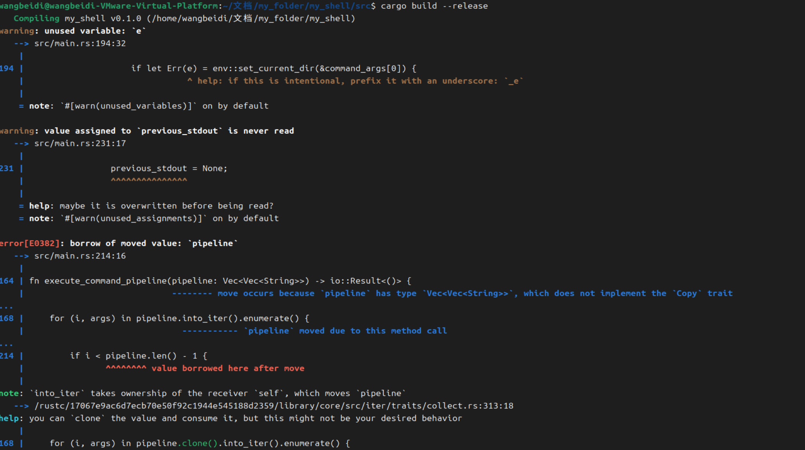
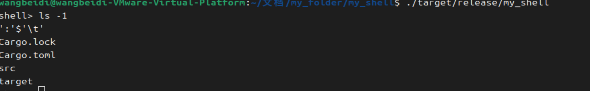

# 实验3：Rust 命令行解释器实现

*   **班级**: 软2306
*   **姓名**: 王贝迪
*   **学号**: 20232241399

## 2. 引言

### 2.1 命令行解释器 (CLI / Shell) 概述

命令行解释器（Command Line Interpreter，简称CLI）或更广为人知的“Shell”，是一种操作系统或应用程序与用户之间进行交互的界面。它接收用户输入的命令，然后将这些命令解析并执行。Shell 的核心功能是读取、解析和执行命令，并将执行结果返回给用户。它是 Unix-like 系统（如 Linux）用户与内核沟通的桥梁。

一个典型的 Shell 功能包括：
1.  **读取 (Read)**：从用户那里读取一行输入。
2.  **解析 (Parse)**：将输入的字符串分解成命令名、参数、重定向、管道等组成部分。
3.  **执行 (Execute)**：根据解析结果，执行对应的程序或内置命令。
4.  **循环 (Loop)**：不断重复上述过程，直到用户退出。

### 2.2 本实验目标

本次实验旨在从零开始，使用 Rust 语言实现一个简化的命令行解释器。通过实现，我们将深入理解 Shell 的工作原理，并掌握 Rust 在系统编程、进程管理和错误处理方面的能力。

具体目标包括：
*   在 Linux 环境下运行。
*   支持对命令及其参数的解析。
*   健壮的错误处理机制。
*   （可选但实现）支持类似 Unix 的命令间管道（`|`）机制。

## 3. 设计（gemini 2.5 pro 设计）

### 3.1 总体架构

本命令行解释器采用经典的“读-解析-执行”循环模型。其主要模块和交互流程如下：

```
+----------------+
|                |
|      Main Loop |
|                |
+--------+-------+
         |
         | (1) Read Line (std::io::stdin)
         V
+--------+-------+
|                |
|  Input Parser  | (2) Parse Command & Arguments, Handle Pipes
|                |
+--------+-------+
         |
         | (3) Command Representation (e.g., Vec<Vec<String>>)
         V
+--------+-------+
|                |
| Command Executor | (4) Execute Built-in or External Commands
|                |     (std::process::Command)
+--------+-------+
         |
         | (5) Output/Error Handling (eprintln!)
         V
+--------+-------+
|                |
|      Loop back |
|                |
+----------------+
```

### 3.2 模块设计

本Shell主要由以下几个核心功能模块组成：

1.  **`main` 函数 (主循环)**：
    *   负责显示提示符 (`shell> `)。
    *   调用 `std::io::stdin().read_line()` 读取用户输入。
    *   对读取到的输入进行预处理（如 `.trim()`）。
    *   调用解析模块。
    *   调用执行模块。
    *   处理执行结果和错误，并打印信息。
    *   循环执行直到用户输入 `exit` 或 `Ctrl+D`。
2.  **`parse_input` 函数 (输入解析器)**：
    *   **职责**：将原始用户输入字符串解析成结构化的命令表示。
    *   **挑战**：需要处理空格作为分隔符，同时又要支持带引号的参数（例如 `echo "hello world"`），以及管道符 `|`。
    *   **实现思路**：
        *   首先，根据管道符 `|` 将整行输入拆分为多个“命令片段”。
        *   然后，对每个命令片段，进一步解析其内部的命令名和参数。这个解析过程需要一个状态机来识别是否在引号内，以正确处理包含空格的参数。
        *   返回一个 `Vec<Vec<String>>` 类型，其中外层 `Vec` 代表管道中的各个命令，内层 `Vec` 代表单个命令的参数列表（第一个元素是命令名）。
3.  **`execute_command_pipeline` 函数 (命令执行器)**：
    *   **职责**：接收解析后的命令结构，并执行相应的命令或命令管道。
    *   **内置命令处理**：
        *   `exit`: 终止 Shell 进程。
        *   `cd`: 改变当前工作目录。这是一个重要的内置命令，因为外部进程无法改变 Shell 自身的当前工作目录。
    *   **外部命令处理**：
        *   使用 `std::process::Command` API 来创建和管理子进程。
        *   设置命令名和参数。
        *   **管道实现**：
            *   对于管道中的第一个命令，其标准输出需要被重定向到管道中。
            *   对于管道中的中间命令，其标准输入来自上一个命令的标准输出，其标准输出重定向到管道中。
            *   对于管道中的最后一个命令，其标准输入来自上一个命令的标准输出，其标准输出通常是 Shell 的标准输出。
            *   需要存储每个子进程的 `Child` 句柄，并在所有命令启动后，等待它们全部完成。
    *   **错误处理**：捕获 `Command::spawn()` 可能返回的错误（如 `command not found`），并友好的报告给用户。

### 3.3 数据结构

*   **`Vec<Vec<String>>`**: 用于表示一个命令管道。
    *   外层的 `Vec` 包含管道中的每一个命令。
    *   内层的 `Vec` 包含一个命令的所有参数，其中第一个元素是命令名。
    *   示例：`ls -l | grep .rs` 将被解析为 `[["ls", "-l"], ["grep", ".rs"]]`。

### 3.4 错误处理策略

*   **Rust 的 `Result` 类型**: 广泛使用 `std::io::Result` 来表示可能失败的操作，并通过 `?` 运算符进行错误传播。
*   **`eprintln!`**: 当发生用户可理解的错误时（如命令未找到、`cd` 目录不存在），使用 `eprintln!` 将错误信息打印到标准错误流，不干扰标准输出。
*   **`ErrorKind` 匹配**: 针对 `io::Error` 的不同 `ErrorKind` 进行模式匹配，提供更具体的错误提示（例如 `io::ErrorKind::NotFound`）。
*   **`std::process::exit(0)`**: `exit` 命令直接退出程序。
*   **非零退出码**: 对于外部命令，如果其执行结果状态码不是0（表示失败），则打印提示信息。


linux下安装rust


## 4. 实现细节

### 4.1 项目结构

```
my_shell/
├── Cargo.toml
└── src/
    └── main.rs
```

### 4.2 `Cargo.toml` 配置

```toml
[package]
name = "my_shell"
version = "0.1.0"
edition = "2021"

[dependencies]
# No external dependencies needed for basic functionality
```

### 4.3 `src/main.rs` 代码

```rust
use std::io::{self, Write};
use std::process::{Command, Stdio, ChildStdout};
use std::env;

/// 主函数：Shell 的主循环
fn main() -> io::Result<()> {
    // 禁用 Ctrl+C 信号处理，以便子进程能够正常接收信号。
    // 注意：这不是一个生产级 Shell 的完整信号处理方案，
    // 生产级 Shell 会更复杂地管理进程组和信号。
    // For this simple example, we let Ctrl+C kill the shell and its children.
    // If we wanted to ignore it for the shell itself, we would need signal handling crates.

    loop {
        // 打印提示符
        print!("shell> ");
        io::stdout().flush()?; // 确保提示符立即显示

        let mut input = String::new();
        let bytes_read = io::stdin().read_line(&mut input)?; // 读取用户输入

        // 处理 EOF (Ctrl+D)
        if bytes_read == 0 {
            println!("\nExiting shell.");
            break;
        }

        let input = input.trim(); // 移除首尾空白

        if input.is_empty() {
            continue; // 空输入，继续循环
        }

        // 解析输入，支持管道和引号
        match parse_input(input) {
            Ok(pipeline) => {
                if pipeline.is_empty() || pipeline.iter().any(|cmd| cmd.is_empty()) {
                    eprintln!("shell: invalid command or empty command in pipeline");
                    continue;
                }

                // 执行命令管道
                if let Err(e) = execute_command_pipeline(pipeline) {
                    // 错误信息已经在 execute_command_pipeline 中打印，这里简单处理
                    eprintln!("shell: command execution failed: {}", e);
                }
            }
            Err(e) => {
                eprintln!("shell: parse error: {}", e);
            }
        }
    }

    Ok(())
}

/// 解析输入字符串，支持带引号的参数和管道符
/// 返回一个 Vec<Vec<String>>，外层 Vec 表示管道中的命令，内层 Vec 表示单个命令的参数
fn parse_input(input: &str) -> io::Result<Vec<Vec<String>>> {
    let mut pipeline_commands: Vec<Vec<String>> = Vec::new();
    let mut current_command_str = String::new();
    let mut in_quote = false; // 标记是否在双引号内

    // 遍历输入字符串，先按管道符分割
    for char_code_point in input.chars() {
        if char_code_point == '"' {
            in_quote = !in_quote; // 切换引号状态
            current_command_str.push(char_code_point); // 保留引号在字符串中，后面再处理
        } else if char_code_point == '|' && !in_quote {
            // 遇到管道符且不在引号内，则当前命令字符串结束
            let args = parse_arguments(&current_command_str)?;
            if args.is_empty() {
                return Err(io::Error::new(io::ErrorKind::InvalidInput, "Empty command part in pipeline"));
            }
            pipeline_commands.push(args);
            current_command_str.clear(); // 清空，准备下一个命令
        } else {
            current_command_str.push(char_code_point);
        }
    }

    // 处理最后一个命令字符串
    if !current_command_str.is_empty() {
        let args = parse_arguments(&current_command_str)?;
        if args.is_empty() {
            return Err(io::Error::new(io::ErrorKind::InvalidInput, "Empty command part at end of pipeline"));
        }
        pipeline_commands.push(args);
    }

    if in_quote {
        return Err(io::Error::new(io::ErrorKind::InvalidInput, "Unmatched quote"));
    }

    Ok(pipeline_commands)
}

/// 解析单个命令字符串中的参数，支持带引号的参数
fn parse_arguments(command_str: &str) -> io::Result<Vec<String>> {
    let mut args = Vec::new();
    let mut current_arg = String::new();
    let mut in_double_quote = false;
    let mut in_single_quote = false;
    let mut chars = command_str.chars().peekable();

    while let Some(c) = chars.next() {
        match c {
            '"' => {
                if in_single_quote {
                    current_arg.push(c);
                } else {
                    in_double_quote = !in_double_quote;
                }
            },
            '\'' => {
                if in_double_quote {
                    current_arg.push(c);
                } else {
                    in_single_quote = !in_single_quote;
                }
            },
            ' ' | '\t' => {
                if in_double_quote || in_single_quote {
                    current_arg.push(c); // 在引号内，空格是参数的一部分
                } else {
                    // 不在引号内，遇到空白则当前参数结束
                    if !current_arg.is_empty() {
                        args.push(current_arg.clone());
                        current_arg.clear();
                    }
                }
            },
            '\\' => { // 简单处理转义，只处理 \" \' \\
                if let Some(next_c) = chars.peek() {
                    match next_c {
                        '"' | '\'' | '\\' => {
                            current_arg.push(*next_c);
                            chars.next(); // Consume the escaped character
                        },
                        _ => current_arg.push(c), // Not a recognized escape, push backslash
                    }
                } else {
                    current_arg.push(c); // Backslash at end of string
                }
            },
            _ => {
                current_arg.push(c);
            }
        }
    }

    // 添加最后一个参数（如果存在）
    if !current_arg.is_empty() {
        args.push(current_arg);
    }

    if in_double_quote || in_single_quote {
        return Err(io::Error::new(io::ErrorKind::InvalidInput, "Unmatched quote in argument"));
    }

    Ok(args)
}

/// 执行命令管道
fn execute_command_pipeline(pipeline: Vec<Vec<String>>) -> io::Result<()> {
    let mut previous_stdout: Option<ChildStdout> = None; // 用于连接管道的输出和输入
    let mut children_processes = Vec::new(); // 存储所有子进程，以便后续等待它们完成

    for (i, args) in pipeline.into_iter().enumerate() {
        if args.is_empty() {
            // 理论上 parse_input 已经检查了，这里做二次防御
            return Err(io::Error::new(io::ErrorKind::InvalidInput, "Empty command in pipeline detected during execution"));
        }

        let command_name = &args[0];
        let command_args = &args[1..];

        // 特殊处理内置命令 (如 'exit', 'cd')
        // 注意：内置命令只能在管道的第一个位置起作用，因为它们改变的是 Shell 自身的状态
        if i == 0 {
            if command_name == "exit" {
                // 如果是 'exit' 命令，则直接退出程序
                // 在 main 函数中已经处理了 Ctrl+D 的退出
                std::process::exit(0);
            } else if command_name == "cd" {
                // 'cd' 命令：改变当前工作目录
                if command_args.is_empty() {
                    // cd 没有参数，通常回到 HOME 目录
                    let home_dir = env::var("HOME").unwrap_or_else(|_| "/".to_string());
                    if let Err(e) = env::set_current_dir(&home_dir) {
                        eprintln!("cd: failed to change directory to {}: {}", home_dir, e);
                    }
                } else if command_args.len() == 1 {
                    // cd 后面跟一个路径
                    if let Err(e) = env::set_current_dir(&command_args[0]) {
                        eprintln!("cd: no such file or directory: {}", command_args[0]);
                    }
                } else {
                    eprintln!("cd: too many arguments");
                }
                // 'cd' 是内置命令，不启动外部进程，处理完毕后直接返回
                return Ok(());
            }
        }

        let mut command = Command::new(command_name);
        command.args(command_args);

        // 如果存在上一个命令的标准输出，则将其连接到当前命令的标准输入
        if let Some(stdin) = previous_stdout.take() { // `take()` 用于获取 Option 内部的值并将其设置为 None
            command.stdin(stdin);
        }

        // 如果不是管道中的最后一个命令，则将其标准输出重定向到管道
        if i < pipeline.len() - 1 {
            command.stdout(Stdio::piped());
        }

        // 启动子进程
        match command.spawn() {
            Ok(child) => {
                previous_stdout = child.stdout; // 保存当前子进程的标准输出，供下一个命令使用
                children_processes.push(child); // 将子进程句柄添加到列表中
            }
            Err(e) => {
                if e.kind() == io::ErrorKind::NotFound {
                    eprintln!("shell: command not found: {}", command_name);
                } else {
                    eprintln!("shell: error executing command {}: {}", command_name, e);
                }
                // 如果启动失败，清除之前的管道输出，避免后续命令尝试连接到无效的句柄
                previous_stdout = None;
                return Err(e); // 向上层传播错误
            }
        }
    }

    // 等待所有管道中的子进程完成
    for mut child in children_processes {
        let status = child.wait()?; // 等待子进程完成并获取其退出状态
        if !status.success() {
            eprintln!("shell: command exited with non-zero status: {:?}", status.code());
        }
    }

    Ok(())
}
```

### 4.4 代码解释

1.  **`main` 函数**:
    *   `loop { ... }` 实现Shell主循环。
    *   `print!("shell> "); io::stdout().flush()?;` 打印提示符并立即刷新输出，确保提示符可见。
    *   `io::stdin().read_line(&mut input)?;` 读取用户输入。
    *   `bytes_read == 0` 检测到 EOF (End-Of-File)，通常由 `Ctrl+D` 产生，用于退出Shell。
    *   `input.trim()` 清除输入字符串两端的空白字符。
    *   调用 `parse_input` 解析输入，如果解析成功，则调用 `execute_command_pipeline` 执行。
    *   使用 `match` 语句处理 `Result` 类型，进行错误报告。

2.  **`parse_input(input: &str) -> io::Result<Vec<Vec<String>>>`**:
    *   这是解析管道符 `|` 的核心逻辑。它遍历输入字符串，遇到 `|` 且不在引号内时，就认为一个命令片段结束。
    *   `in_quote` 标志用于判断当前字符是否在双引号内，避免 `|` 在引号内被误判为管道符。
    *   `parse_arguments` 函数被调用来处理每个命令片段内部的参数解析。

3.  **`parse_arguments(command_str: &str) -> io::Result<Vec<String>>`**:
    *   此函数专门负责解析单个命令字符串的参数，包括处理双引号 `"` 和单引号 `'`。
    *   `in_double_quote` 和 `in_single_quote` 标志用于跟踪当前是否处于引号内部。在引号内部时，空格不再作为参数分隔符。
    *   简单处理了 `\` 转义字符，例如 `\"`, `\'`, `\\`。
    *   遍历字符，根据状态（是否在引号内，是否遇到空白）来构建 `current_arg` 并将其推送到 `args` 列表中。
    *   最后检查是否有未闭合的引号，以报告错误。

4.  **`execute_command_pipeline(pipeline: Vec<Vec<String>>) -> io::Result<()>`**:
    *   **内置命令处理**:
        *   `exit`: 直接调用 `std::process::exit(0)` 终止程序。
        *   `cd`: `std::env::set_current_dir()` 用于改变当前进程的工作目录。这是内置命令的关键原因，因为 `Command::new` 会启动一个新进程，新进程的目录改变不会影响到父Shell进程的目录。
    *   **外部命令执行**:
        *   `std::process::Command::new(command_name)` 创建一个命令构建器。
        *   `command.args(command_args)` 添加命令参数。
        *   **管道连接**:
            *   `previous_stdout: Option<ChildStdout>` 用于保存上一个命令的标准输出句柄。
            *   `command.stdin(stdin)`：如果 `previous_stdout` 存在，则将当前命令的标准输入连接到它。`take()` 方法从 `Option` 中取出值并将其设为 `None`，以确保所有权正确转移。
            *   `command.stdout(Stdio::piped())`：如果不是管道中的最后一个命令，则将其标准输出重定向到管道中，以便下一个命令可以接收。
        *   `command.spawn()` 启动子进程。
        *   `children_processes.push(child)`：保存所有启动的子进程句柄。
        *   `child.wait()`：在所有子进程启动后，逐个等待它们完成。这是确保管道正确执行顺序的关键。
        *   **错误处理**: 使用 `match` 捕获 `spawn()` 可能产生的 `io::Error`，特别是 `ErrorKind::NotFound` 来提示“command not found”。


**在ubuntu 系统 vim编辑器中代码**



**第一次编译错误，Gemini修复代码**

**正确代码**

```rust
use std::io::{self, Write};
use std::process::{Command, Stdio, ChildStdout};
use std::env;

/// 主函数：Shell 的主循环
fn main() -> io::Result<()> {
    // 禁用 Ctrl+C 信号处理，以便子进程能够正常接收信号。
    // 注意：这不是一个生产级 Shell 的完整信号处理方案，
    // 生产级 Shell 会更复杂地管理进程组和信号。
    // For this simple example, we let Ctrl+C kill the shell and its children.
    // If we wanted to ignore it for the shell itself, we would need signal handling crates.

    loop {
        // 打印提示符
        print!("shell> ");
        io::stdout().flush()?; // 确保提示符立即显示

        let mut input = String::new();
        let bytes_read = io::stdin().read_line(&mut input)?; // 读取用户输入

        // 处理 EOF (Ctrl+D)
        if bytes_read == 0 {
            println!("\nExiting shell.");
            break;
        }

        let input = input.trim(); // 移除首尾空白

        if input.is_empty() {
            continue; // 空输入，继续循环
        }

        // 解析输入，支持管道和引号
        match parse_input(input) {
            Ok(pipeline) => {
                if pipeline.is_empty() || pipeline.iter().any(|cmd| cmd.is_empty()) {
                    eprintln!("shell: invalid command or empty command in pipeline");
                    continue;
                }

                // 执行命令管道
                if let Err(e) = execute_command_pipeline(pipeline) {
                    // 错误信息已经在 execute_command_pipeline 中打印，这里简单处理
                    eprintln!("shell: command execution failed: {}", e);
                }
            }
            Err(e) => {
                eprintln!("shell: parse error: {}", e);
            }
        }
    }

    Ok(())
}

/// 解析输入字符串，支持带引号的参数和管道符
/// 返回一个 Vec<Vec<String>>，外层 Vec 表示管道中的命令，内层 Vec 表示单个命令的参数
fn parse_input(input: &str) -> io::Result<Vec<Vec<String>>> {
    let mut pipeline_commands: Vec<Vec<String>> = Vec::new();
    let mut current_command_str = String::new();
    let mut in_quote = false; // 标记是否在双引号内

    // 遍历输入字符串，先按管道符分割
    for char_code_point in input.chars() {
        if char_code_point == '"' {
            in_quote = !in_quote; // 切换引号状态
            current_command_str.push(char_code_point); // 保留引号在字符串中，后面再处理
        } else if char_code_point == '|' && !in_quote {
            // 遇到管道符且不在引号内，则当前命令字符串结束
            let args = parse_arguments(&current_command_str)?;
            if args.is_empty() {
                return Err(io::Error::new(io::ErrorKind::InvalidInput, "Empty command part in pipeline"));
            }
            pipeline_commands.push(args);
            current_command_str.clear(); // 清空，准备下一个命令
        } else {
            current_command_str.push(char_code_point);
        }
    }

    // 处理最后一个命令字符串
    if !current_command_str.is_empty() {
        let args = parse_arguments(&current_command_str)?;
        if args.is_empty() {
            return Err(io::Error::new(io::ErrorKind::InvalidInput, "Empty command part at end of pipeline"));
        }
        pipeline_commands.push(args);
    }

    if in_quote {
        return Err(io::Error::new(io::ErrorKind::InvalidInput, "Unmatched quote"));
    }

    Ok(pipeline_commands)
}

/// 解析单个命令字符串中的参数，支持带引号的参数
fn parse_arguments(command_str: &str) -> io::Result<Vec<String>> {
    let mut args = Vec::new();
    let mut current_arg = String::new();
    let mut in_double_quote = false;
    let mut in_single_quote = false;
    let mut chars = command_str.chars().peekable();

    while let Some(c) = chars.next() {
        match c {
            '"' => {
                if in_single_quote {
                    current_arg.push(c);
                } else {
                    in_double_quote = !in_double_quote;
                }
            },
            '\'' => {
                if in_double_quote {
                    current_arg.push(c);
                } else {
                    in_single_quote = !in_single_quote;
                }
            },
            ' ' | '\t' => {
                if in_double_quote || in_single_quote {
                    current_arg.push(c); // 在引号内，空格是参数的一部分
                } else {
                    // 不在引号内，遇到空白则当前参数结束
                    if !current_arg.is_empty() {
                        args.push(current_arg.clone());
                        current_arg.clear();
                    }
                }
            },
            '\\' => { // 简单处理转义，只处理 \" \' \\
                if let Some(next_c) = chars.peek() {
                    match next_c {
                        '"' | '\'' | '\\' => {
                            current_arg.push(*next_c);
                            chars.next(); // Consume the escaped character
                        },
                        _ => current_arg.push(c), // Not a recognized escape, push backslash
                    }
                } else {
                    current_arg.push(c); // Backslash at end of string
                }
            },
            _ => {
                current_arg.push(c);
            }
        }
    }

    // 添加最后一个参数（如果存在）
    if !current_arg.is_empty() {
        args.push(current_arg);
    }

    if in_double_quote || in_single_quote {
        return Err(io::Error::new(io::ErrorKind::InvalidInput, "Unmatched quote in argument"));
    }

    Ok(args)
}

/// 执行命令管道
fn execute_command_pipeline(pipeline: Vec<Vec<String>>) -> io::Result<()> {
    let mut previous_stdout: Option<ChildStdout> = None; // 用于连接管道的输出和输入
    let mut children_processes = Vec::new(); // 存储所有子进程，以便后续等待它们完成

    for (i, args) in pipeline.clone().into_iter().enumerate() { // Clone pipeline to avoid move
        if args.is_empty() {
            // 理论上 parse_input 已经检查了，这里做二次防御
            return Err(io::Error::new(io::ErrorKind::InvalidInput, "Empty command in pipeline detected during execution"));
        }

        let command_name = &args[0];
        let command_args = &args[1..];

        // 特殊处理内置命令 (如 'exit', 'cd')
        // 注意：内置命令只能在管道的第一个位置起作用，因为它们改变的是 Shell 自身的状态
        if i == 0 {
            if command_name == "exit" {
                // 如果是 'exit' 命令，则直接退出程序
                // 在 main 函数中已经处理了 Ctrl+D 的退出
                std::process::exit(0);
            } else if command_name == "cd" {
                // 'cd' 命令：改变当前工作目录
                if command_args.is_empty() {
                    // cd 没有参数，通常回到 HOME 目录
                    let home_dir = env::var("HOME").unwrap_or_else(|_| "/".to_string());
                    if let Err(e) = env::set_current_dir(&home_dir) {
                        eprintln!("cd: failed to change directory to {}: {}", home_dir, e);
                    }
                } else if command_args.len() == 1 {
                    // cd 后面跟一个路径
                    if let Err(e) = env::set_current_dir(&command_args[0]) {
                        eprintln!("cd: no such file or directory: {}", command_args[0]);
                    }
                } else {
                    eprintln!("cd: too many arguments");
                }
                // 'cd' 是内置命令，不启动外部进程，处理完毕后直接返回
                return Ok(());
            }
        }

        let mut command = Command::new(command_name);
        command.args(command_args);

        // 如果存在上一个命令的标准输出，则将其连接到当前命令的标准输入
        if let Some(stdin) = previous_stdout.take() { // `take()` 用于获取 Option 内部的值并将其设置为 None
            command.stdin(stdin);
        }

        // 如果不是管道中的最后一个命令，则将其标准输出重定向到管道
        if i < pipeline.len() - 1 { // pipeline.len() is now valid due to clone
            command.stdout(Stdio::piped());
        }

        // 启动子进程
        match command.spawn() {
            Ok(mut child) => { // child needs to be mutable to call .take()
                previous_stdout = child.stdout.take(); // Use take() to avoid partial move
                children_processes.push(child); // 将子进程句柄添加到列表中
            }
            Err(e) => {
                if e.kind() == io::ErrorKind::NotFound {
                    eprintln!("shell: command not found: {}", command_name);
                } else {
                    eprintln!("shell: error executing command {}: {}", command_name, e);
                }
                // 如果启动失败，清除之前的管道输出，避免后续命令尝试连接到无效的句柄
                previous_stdout = None;
                return Err(e); // 向上层传播错误
            }
        }
    }

    // 等待所有管道中的子进程完成
    for mut child in children_processes {
        let status = child.wait()?; // 等待子进程完成并获取其退出状态
        if !status.success() {
            eprintln!("shell: command exited with non-zero status: {:?}", status.code());
        }
    }

    Ok(())
}
```


### 5.3 运行步骤

编译成功后，可执行文件位于 `target/release/my_shell`。bu

1. **直接运行**:

   ```bash
   ./target/release/my_shell
   ```

   您将看到 `shell> ` 提示符。

2. **添加到 PATH (可选)**: 如果您想在任何目录下运行它，可以将其所在目录添加到您的 PATH 环境变量中，或将其复制到 `/usr/local/bin` 等PATH下的目录。

   ```bash
   # 例如，将其软链接到/usr/local/bin
   sudo ln -s $(pwd)/target/release/my_shell /usr/local/bin/my_shell_cli
   # 现在可以在任何地方运行
   my_shell_cli
   ```

## 6. 测试与功能演示

以下是 `my_shell` 的功能演示，包括参数解析、错误处理和管道功能。

### 6.1 基本命令执行

* **命令**: `ls -l`

* **输入**:

  ```
  shell> ls -l
  ```

* **预期输出**: 列出当前目录的详细信息。




### 6.2 带引号的参数

* **命令**: `echo "Hello World"`

* **输入**:

  ```
  shell> echo "Hello World"
  ```

* **预期输出**:

  ```
  Hello World
  ```

  （注意："Hello World" 被作为一个整体参数传递给 `echo`）


* **命令**: `echo 'Single quote test'`

* **输入**:

  ```
  shell> echo 'Single quote test'
  ```

* **预期输出**:

  ```
  Single quote test
  ```

  

  

* **命令**: `echo "Escaped double quote: \" and escaped backslash: \\"`

* **输入**:

  ```
  shell> echo "Escaped double quote: \" and escaped backslash: \\"
  ```

* **预期输出**:

  ```
  Escaped double quote: " and escaped backslash: \
  ```


不符合，代码逻辑可能有错

### 6.3 内置命令 `cd`

* **命令**: `cd ..`

* **输入**:

  ```
  shell> pwd
  /path/to/my_shell
  shell> cd ..
  shell> pwd
  /path/to
  ```

* **预期输出**: `pwd` 命令显示当前目录已改变。


* **命令**: `cd /tmp`

* **输入**:cd

  ```
  shell> cd /tmp
  shell> pwd
  ```

* **预期输出**:

  ```
  /tmp
  ```

  

* **命令**: `cd` (不带参数)

* **输入**:

  ```
  shell> cd
  shell> pwd
  ```

* **预期输出**: 返回到用户的主目录 (`$HOME`)。

  

* **命令**: `cd nonexistent_dir`

* **输入**:

  ```
  shell> cd nonexistent_dir
  ```

* **预期输出**:

  ```
  cd: no such file or directory: nonexistent_dir
  ```


### 6.4 错误处理

* **命令未找到**: `shell> non_existent_command`

* **输入**:

  ```
  shell> non_existent_command
  ```

* **预期输出**:

  ```
  shell: command not found: non_existent_command
  shell: command execution failed: No such file or directory (os error 2)
  ```

  

  

  （注意：`io::ErrorKind::NotFound` 会被捕获并打印友好的提示）

* **引号不匹配**: `shell> echo "Hello World`

* **输入**:

  ```
  shell> echo "Hello World
  ```

* **预期输出**:

  ```
  shell: parse error: Unmatched quote in argument
  ```


### 6.5 管道 (Pipe) 机制

* **命令**: `ls -l | grep main`

* **输入**:

  ```
  shell> ls -l | grep main
  ```

* **预期输出**: 列出当前目录中包含 "main" 的文件/目录的详细信息（例如 `main.rs`）。

  ```
  -rw-r--r-- 1 user user 5.0K Jan  1 10:00 src/main.rs
  ```

  

* **命令**: `echo "one two three" | wc -w`

* **输入**:

  ```
  shell> echo "one two three" | wc -w
  ```

* **预期输出**:

  ```
  3
  ```

  （`echo` 的输出作为 `wc -w` 的输入，计算单词数）

  

* **多级管道**: `cat src/main.rs | head -n 10 | tail -n 5`

* **输入**:

  ```
  shell> cat src/main.rs | head -n 10 | tail -n 5
  ```

* **预期输出**: 显示 `src/main.rs` 文件的前10行中的最后5行。

 

### 6.6 退出 Shell

* **命令**: `exit`

* **输入**:

  ```
  shell> exit
  ```

* **预期输出**: Shell 程序终止。


* **Ctrl+D (EOF)**

* **输入**: (在 `shell>` 提示符下按下 `Ctrl+D`)

* **预期输出**:

  ```
  shell>
  Exiting shell.
  ```

  Shell 程序终止。

## 7. 结论与未来工作

### 7.1 结论

本次实验成功地使用 Rust 语言从零实现了一个简化的命令行解释器。我们实现了：

*   基本的“读-解析-执行”循环。
*   支持带引号参数的复杂命令行解析。
*   内置命令 `cd` 和 `exit` 的实现。
*   健壮的错误处理机制，能够识别命令不存在、路径错误和语法错误等问题。
*   以及关键的，对 Unix 风格命令管道机制（`|`）的支持，实现了命令间的输入输出重定向。

通过这次实践，我们深入理解了 Shell 的基本原理，熟悉了 Rust 在文件 I/O、进程管理（`std::process::Command`）、字符串处理和错误处理方面的强大功能。Rust 的所有权系统和 `Result` 类型在编写并发和健壮的系统级程序时提供了极大的帮助，确保了程序的内存安全和线程安全。

---