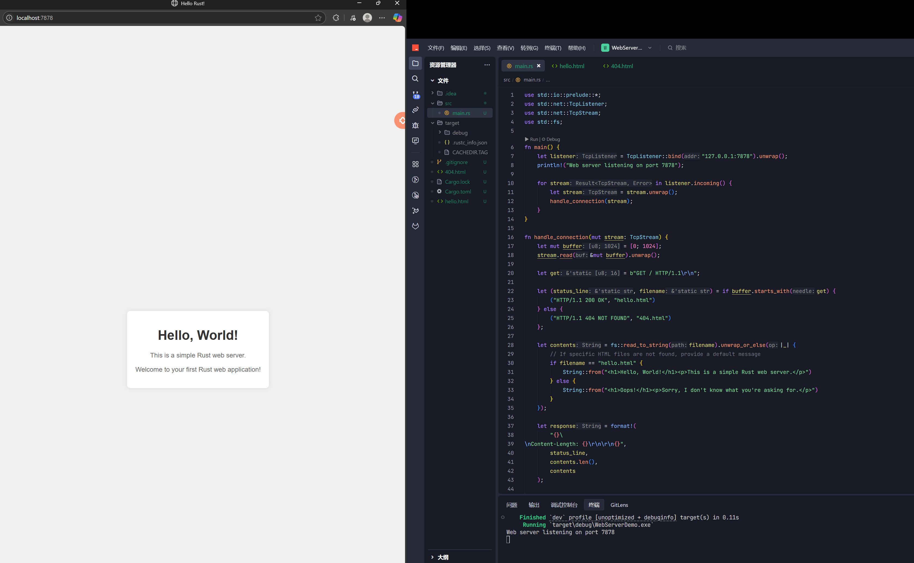
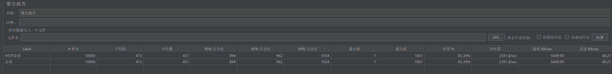
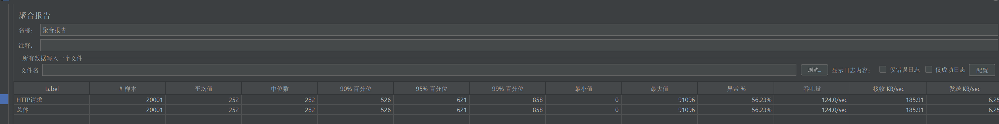

---

## Lab5 实验报告 - Web 服务器实现与性能对比

### 1. 个人信息

*   **班级：** 软2306
*   **姓名：** 王贝迪
*   **学号：** 20232241399

### 2. 引言与背景

#### 2.1 Web 服务器概念
*   简述什么是 Web 服务器（例如，接收 HTTP 请求，处理请求，返回 HTTP 响应）。
*   提及 HTTP 协议的基础（请求行、头部、正文；响应行、头部、正文；常见的状态码如 200 OK, 404 Not Found）。

#### 2.2 Rust 在 Web 服务器开发中的优势
*   简述为什么选择 Rust（例如，内存安全、并发安全、性能）。

#### 2.3 本实验目标
*   说明本实验旨在通过实现三种不同并发模型的 Web 服务器，理解其原理并比较其性能。

### 3. 单线程 Web 服务器实现

#### 3.1 设计思路
*   描述单线程服务器的工作流程：
    1.  监听指定端口。
    2.  循环接受客户端连接。
    3.  对于每个连接：
        *   读取 HTTP 请求。
        *   解析请求（例如，获取请求的路径）。
        *   根据路径查找文件或生成响应。
        *   发送 HTTP 响应。
        *   关闭连接。
*   强调其“一次处理一个请求”的特性。

#### 3.2 核心代码
*   
    
    ```rust
    use std::io::prelude::*;
    use std::net::TcpListener;
    use std::net::TcpStream;
    use std::fs;
    
    fn main() {
        let listener = TcpListener::bind("127.0.0.1:7878").unwrap();
        println!("Web server listening on port 7878");
    
        for stream in listener.incoming() {
            let stream = stream.unwrap();
            handle_connection(stream);
        }
    }
    
    fn handle_connection(mut stream: TcpStream) {
        let mut buffer = [0; 1024];
        stream.read(&mut buffer).unwrap();
    
        let get = b"GET / HTTP/1.1\r\n";
    
        let (status_line, filename) = if buffer.starts_with(get) {
            ("HTTP/1.1 200 OK", "hello.html")
        } else {
            ("HTTP/1.1 404 NOT FOUND", "404.html")
        };
    
        let contents = fs::read_to_string(filename).unwrap_or_else(|_| {
            // If specific HTML files are not found, provide a default message
            if filename == "hello.html" {
                String::from("<h1>Hello, World!</h1><p>This is a simple Rust web server.</p>")
            } else {
                String::from("<h1>Oops!</h1><p>Sorry, I don't know what you're asking for.</p>")
            }
        });
    
        let response = format!(
            "{}\
    \nContent-Length: {}\r\n\r\n{}",
            status_line,
            contents.len(),
            contents
        );
    
        stream.write(response.as_bytes()).unwrap();
        stream.flush().unwrap();
    }
    ```
    *   *需要创建 `index.html`, `hello.html`, and `404.html` 文件。*
    
* hello.html

```html
<!DOCTYPE html>
<html lang="en">
<head>
    <meta charset="UTF-8">
    <meta name="viewport" content="width=device-width, initial-scale=1.0">
    <title>Hello Rust!</title>
    <style>
        body {
            font-family: Arial, sans-serif;
            margin: 0;
            padding: 0;
            display: flex;
            justify-content: center;
            align-items: center;
            height: 100vh;
            background-color: #f0f0f0;
        }
        .container {
            text-align: center;
            padding: 20px;
            background-color: white;
            border-radius: 8px;
            box-shadow: 0 0 10px rgba(0,0,0,0.1);
        }
        h1 {
            color: #333;
        }
        p {
            color: #666;
        }
    </style>
</head>
<body>
    <div class="container">
        <h1>Hello, World!</h1>
        <p>This is a simple Rust web server.</p>
        <p>Welcome to your first Rust web application!</p>
    </div>
</body>
</html>
```

404.html

```html
<!DOCTYPE html>
<html lang="en">
<head>
    <meta charset="UTF-8">
    <meta name="viewport" content="width=device-width, initial-scale=1.0">
    <title>404 Not Found</title>
    <style>
        body {
            font-family: Arial, sans-serif;
            margin: 0;
            padding: 0;
            display: flex;
            justify-content: center;
            align-items: center;
            height: 100vh;
            background-color: #f0f0f0;
        }
        .container {
            text-align: center;
            padding: 20px;
            background-color: white;
            border-radius: 8px;
            box-shadow: 0 0 10px rgba(0,0,0,0.1);
        }
        h1 {
            color: #e74c3c;
        }
        p {
            color: #666;
        }
        a {
            color: #3498db;
            text-decoration: none;
        }
        a:hover {
            text-decoration: underline;
        }
    </style>
</head>
<body>
    <div class="container">
        <h1>Oops! 404</h1>
        <p>Sorry, the page you are looking for could not be found.</p>
        <p><a href="/">Go back to the homepage</a></p>
    </div>
</body>
</html>
```

#### 3.3 优缺点分析
*   **优点：** 实现简单，逻辑清晰。
*   **缺点：** 无法并发处理请求，一个请求阻塞时，后续请求必须等待，性能差。





### 4. 多线程 Web 服务器实现

#### 4.1 设计思路
*   描述多线程服务器的工作流程：
    1.  监听指定端口。
    2.  创建一个线程池）。
    3.  循环接受客户端连接。
    4.  对于每个新连接，从线程池中获取一个线程（或创建一个新线程）来处理该连接。
    5.  `handle_connection` 函数的逻辑与单线程版本类似。
*   强调其“每个连接一个线程”或“线程池复用线程”的并发处理能力。

#### 4.2 核心代码与解析


```rust
use actix_web::{get, web, App, HttpServer, Responder};

#[get("/")]
async fn hello() -> impl Responder {
    "Hello, world!"
}

async fn manual_hello() -> impl Responder {
    "Hey there!"
}

#[actix_web::main]
async fn main() -> std::io::Result<()> {
    println!("Starting server at http://127.0.0.1:");
    HttpServer::new(|| {
        App::new()
            .service(hello)
            .route("/hey", web::get().to(manual_hello))
    })
    .workers(4) // Specify the number of worker threads
    .bind(("127.0.0.1", 8080))?
    .run()
    .await
}

```

*   **讨论线程池：** 你可以参考 Rust 官方文档《Rust 程序设计语言》第 20 章“构建一个多线程 Web Server”来实现一个简单的线程池。这能避免无限创建线程的开销。

#### 4.3 优缺点分析
*   **优点：** 能够并发处理多个请求，显著提升吞吐量和响应性。
*   **缺点：**
    *   线程创建和销毁有开销（如果不是用线程池）。
    *   线程本身消耗资源（栈空间）。
    *   大量线程会导致上下文切换开销，性能达到瓶颈后可能下降。
    *   操作系统对线程数量有限制。

### 5. 基于 Tokio 的异步 I/O Web 服务器实现

#### 5.1 设计思路
*   简述异步 I/O 和 `async/await` 的概念。
*   描述 Tokio 服务器的工作流程：
    1.  设置 Tokio 运行时 (`#[tokio::main]`)。
    2.  使用 `tokio::net::TcpListener` 异步监听端口。
    3.  循环 `accept()` 新连接（这是一个 `.await` 点）。
    4.  对于每个新连接，`tokio::spawn` 一个新的异步任务来处理该连接。
    5.  在 `handle_connection_async` 内部，使用 `AsyncReadExt` 和 `AsyncWriteExt` 进行异步读写（这些也是 `.await` 点）。
*   强调其“单线程（或少量线程）处理大量并发连接”通过事件循环和非阻塞 I/O 实现。

#### 5.2 核心代码与解析
*   在 `Cargo.toml` 中添加 Tokio:
    ```toml
    [dependencies]
    tokio = { version = "1", features = ["full"] }
    ```
*   展示关键代码片段（`#[tokio::main]`, `TcpListener::bind`, `listener.accept().await`, `tokio::spawn`, `stream.read().await`, `stream.write_all().await`）。
*   
    ```rust
    use std::convert::Infallible;
    use std::net::SocketAddr;
    use hyper::service::{make_service_fn, service_fn};
    use hyper::{Body, Request, Response, Server};
    
    async fn handle_request(_req: Request<Body>) -> Result<Response<Body>, Infallible> {
        Ok(Response::new("Hello, World!".into()))
    }
    
    #[tokio::main]
    async fn main() {
        let addr = SocketAddr::from(([127, 0, 0, 1], 3000));
    
        // A `Service` is needed for every connection, so this
        // creates one from our `handle_request` function.
        let make_svc = make_service_fn(|_conn| async {
            // service_fn converts our function into a `Service`
            Ok::<_, Infallible>(service_fn(handle_request))
        });
    
        let server = Server::bind(&addr).serve(make_svc);
    
        println!("Listening on http://{}", addr);
    
        // Run this server for... forever!
        if let Err(e) = server.await {
            eprintln!("server error: {}", e);
        }
    }
    
    ```

#### 5.3 优缺点分析
*   **优点：**
    *   极高的并发处理能力，尤其适合 I/O 密集型任务。
    *   资源利用率高（少量线程管理大量连接）。
    *   避免了线程上下文切换的开销。
*   **缺点：**
    *   `async/await` 的心智模型相对复杂。
    *   如果存在长时间运行的 CPU 密集型阻塞代码，会阻塞整个事件循环（除非正确使用 `tokio::task::spawn_blocking`）。
    *   生态系统和调试可能比同步代码略复杂。

### 6. 性能对比

#### 6.1 测试环境
*   **硬件：** CPU型号 AMD Ryzen7 6800h，核心数8 ，16线程。
*   **测试工具：**
    *   Apache Jmeter
*   **测试场景：**
    *   html请求

#### 6.2 测试方法
记录的关键指标：
*   **Requests per second (RPS / QPS):** 每秒处理的请求数。
*   **Error Rate:** 错误请求的百分比。

#### 6.3 测试结果与图表
* 用表格清晰展示不同并发级别下，三个版本服务器的 RPS, Latency 等数据。

* **示例表格：**

  | 并发连接数 | 服务器类型 | RPS  | 错误率 |
  | :--------: | :--------: | :--- | :----- |
  |    500     |   多线程   | 500  | 0      |
  |    500     | Tokio 异步 | 500  | 0      |
  |   10000    |   单线程   | 473  | 85.39% |
  |   10000    |   多线程   | 124  | 56.23  |
  |   10000    | Tokio 异步 |      |        |
  |    100     |   单线程   | 100  | 0      |
  |    100     |   多线程   | 100  | 0      |
  |    100     | Tokio 异步 | 100  | 0      |
  |    500     |   单线程   | 500  | 0      |






测试不准，可能因为http配置不足

jmeter

#### 6.4 理论结果分析
*   **单线程服务器：** 预期 RPS 很低，并且随着并发数增加，RPS 不会显著提升，延迟会急剧增加。
*   **多线程服务器：** 预期 RPS 比单线程高得多。当并发数较低时，性能良好。当并发数非常高时，性能可能因线程开销而趋于平缓或略有下降。
*   **Tokio 异步服务器：** 预期在高中并发下表现最好，RPS 最高，延迟相对稳定。
*   解释结果，将其与各实现的理论优缺点联系起来。例如，为什么 Tokio 在高并发下表现好？为什么单线程在高并发下表现差？


---

